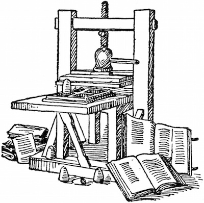

# Introduction
# はじめに

## 翻訳にあたって

この文書はPatricio Gonzalez Vivoの The Book of Shader の日本語訳です。
技術的な内容はできる限り正確に伝えるように心がけますが、その他の部分では読みやすさを優先してラフに訳し、一部ではざっくり表現を変えたり簡略化することもあると思います。まだ全部は訳していないし本編もまだ執筆中なので予想です。英語が得意な方はぜひ原文もどうぞ。

<canvas id="custom" class="canvas" data-fragment-url="cmyk-halftone.frag" data-textures="vangogh.jpg" width="700px" height="320px"></canvas>

The images above were made in different ways. The first one was made by Van Gogh's hand applying layer over layer of paint. It took him hours. The second was produced in seconds by the combination of four matrices of pixels: one for cyan, one for magenta, one for yellow and one for black. The key difference is that the second image is produced in a non-serial way (that means not step-by-step, but all at the same time).

上の2枚の画像は全く異なる方法で作られたものです。1枚目の画像はゴッホが時間をかけて絵の具を塗り重ねていくことによって、2枚目はシアン、マゼンタ、イエロー、ブラックの4色の網点の組み合わせでほんの短い時間で生み出されました。2枚目の画像は手順を重ねるのではなく、すべての点が同時に描かれているというのが大きな違いです。

This book is about the revolutionary computational technique, *fragment shaders*, that is taking digitally generated images to the next level. You can think of it as the equivalent of Gutenberg's press for graphics.

これはデジタルな画像生成を次の次元に押し上げる、フラグメントシェーダーというグーテンベルグの活版印刷にも匹敵する画期的な技術についての本です。

Fragment shaders give you total control over the pixels rendered on the screen at a super fast speed. This is why they're used in all sort of cases, from video filters on cellphones to incredible 3D video games.

フラグメントシェーダーを使うと画面に表示されるピクセルを非常に高速かつ自由にコントロールすることができます。そのためフラグメントシェーダーはスマートフォンで映像にフィルターをかけるようなことから、驚くようなクオリィティーの3Dゲームまで、様々な用途に使われています。

In the following chapters you will discover how incredibly fast and powerful this technique is and how to apply it to your professional and personal work.

この本ではフラグメントシェーダーがどれだけ高速でパワフルな技術か、またそれを仕事や個人のプロジェクトの中で使う方法について説明します。

## Who is this book for?
## 想定される読者

This book is written for creative coders, game developers and engineers who have coding experience, a basic knowledge of linear algebra and trigonometry, and who want to take their work to an exciting new level of graphical quality. (If you want to learn how to code, I highly recommend you start with [Processing](https://processing.org/) and come back later when you are comfortable with it.)

この本は基本的な線形代数と三角関数の知識とプログラム経験があり、ひとつ上の刺激的なグラフィックを目指すクリエイティブコーダー、ゲームディベロッパーなどの開発者に向けて書かれています。もしコーディングについて学びたい場合は[Processing](https://processing.org/)を勉強することから始めて戻ってくることをお勧めします。

This book will teach you how to use and integrate shaders into your projects, improving their performance and graphical quality. Because GLSL (OpenGL Shading Language) shaders compile and run on a variety of platforms, you will be able to apply what you learn here to any enviroment that uses OpenGL, OpenGL ES or WebGL. In other words, you will be able to apply and use your knowledge with [Processing](https://processing.org/) sketches, [openFrameworks](http://openframeworks.cc/) applications, [Cinder](http://libcinder.org/) interactive installations, [Three.js](http://threejs.org/) websites or iOS/Android games.

この本ではフラグメントシェーダーをプロジェクトに組み込む方法、パフォーマンスやグラフィクスのクオリティを改善する方法についても取り上げます。GLSL (OpenGL Shading Language, OpenGLシェーダー言語)は様々なプラットフォーム上でコンパイルして走らせることができるので、ここで学んだことはOpenGL、OpenGL ESまたはWebGLを使うことのできるどんな環境でも生かすことができます。たとえば、[Processing](https://processing.org/)のスケッチ、 [openFrameworks](http://openframeworks.cc/)で作ったアプリケーション、 [Cinder](http://libcinder.org/)で作ったインスタレーション、 [Three.js](http://threejs.org/)を用いたウェブサイトやiOS/Androidのゲームなどが対象になります。

## What does this book cover?
## この本で取り上げること

This book will focus on the use of GLSL pixel shaders. First we'll define what shaders are; then we'll learn how to make procedural shapes, patterns, textures and animations with them. You'll learn the foundations of shading language and apply it to more useful scenarios such as: image processing (image operations, matrix convolutions, blurs, color filters, lookup tables and other effects) and simulations (Conway's game of life, Gray-Scott's reaction-diffusion, water ripples, watercolor effects, Voronoi cells, etc.). Towards the end of the book we'll see a set of advanced techniques based on Ray Marching.

この本では主にGLSLピクセルシェーダーについて説明します。シェーダーとは何かの定義から始まり、プログラムを用いて形や模様、質感や動きを作る方法について学びます。シェーダー言語の基礎とともに、畳み込み、ぼかし、カラーフィルター、ルックアップテーブルなどの画像処理技術、コンウェイのライフゲーム、グレイ=スコットの反応拡散系、水の波紋、水彩、ボロノイ図のようなシミュレーションなどより役に立つシナリオに応用する方法についても説明します。本の終わりの方ではレイマーチングに基づく高度なテクニックに触れます。

*There are interactive examples for you to play with in every chapter.* When you change the code, you will see the changes immediately. The concepts can be abstract and confusing, so the interactive examples are essential to helping you learn the material. The faster you put the concepts into motion the easier the learning process will be.

どの章にも動かして試すことのできるサンプルがついています。サンプルのコードを書き換えれば結果を即座に見ることもできます。抽象的な概念はわかりにくいことがあるので、サンプルはそれぞれの題材を学ぶためにとても役にたちます。学んだことを実際に試してみることでより学習が楽になるでしょう。

What this book doesn't cover:
この本で取り上げること

* This *is not* an openGL or webGL book. OpenGL/webGL is a bigger subject than GLSL or fragment shaders. To learn more about openGL/webGL I recommend taking a look at:  [OpenGL Introduction](https://open.gl/introduction), [the 8th edition of the OpenGL Programming Guide](http://www.amazon.com/OpenGL-Programming-Guide-Official-Learning/dp/0321773039/ref=sr_1_1?s=books&ie=UTF8&qid=1424007417&sr=1-1&keywords=open+gl+programming+guide) (also known as the red book) or [WebGL: Up and Running](http://www.amazon.com/WebGL-Up-Running-Tony-Parisi/dp/144932357X/ref=sr_1_4?s=books&ie=UTF8&qid=1425147254&sr=1-4&keywords=webgl)

* この本はOpenGLやWebGLの本ではありません。OpenGL、WebGLはGLSLやフラグメントシェーダーよりもより広いトピックです。もしOpenGL、WebGLについてもっと学びたい場合は下記のページや本をお勧めします。
[OpenGL Introduction](https://open.gl/introduction)
[the 8th edition of the OpenGL Programming Guide](http://www.amazon.com/OpenGL-Programming-Guide-Official-Learning/dp/0321773039/ref=sr_1_1?s=books&ie=UTF8&qid=1424007417&sr=1-1&keywords=open+gl+programming+guide) (赤本)
[WebGL: Up and Running](http://www.amazon.com/WebGL-Up-Running-Tony-Parisi/dp/144932357X/ref=sr_1_4?s=books&ie=UTF8&qid=1425147254&sr=1-4&keywords=webgl)

* This *is not* a math book. Although we will cover a number of algorithms and techniques that rely on an understanding of algebra and trigonometry, we will not explain them in detail. For questions regarding the math I recommend keeping one of the following books nearby: [3rd Edition of Mathematics for 3D Game Programming and computer Graphics](http://www.amazon.com/Mathematics-Programming-Computer-Graphics-Third/dp/1435458869/ref=sr_1_1?ie=UTF8&qid=1424007839&sr=8-1&keywords=mathematics+for+games) or [2nd Edition of Essential Mathematics for Games and Interactive Applications](http://www.amazon.com/Essential-Mathematics-Games-Interactive-Applications/dp/0123742978/ref=sr_1_1?ie=UTF8&qid=1424007889&sr=8-1&keywords=essentials+mathematics+for+developers).

* この本は数学の本ではありません。代数や三角関数が必要なアルゴリズムやテクニックもとりあげますが、数学についての詳しい説明は省略します。数学的な概念について知りたい場合は下記の本を手元に置いておくと良いでしょう。
[3rd Edition of Mathematics for 3D Game Programming and computer Graphics](http://www.amazon.com/Mathematics-Programming-Computer-Graphics-Third/dp/1435458869/ref=sr_1_1?ie=UTF8&qid=1424007839&sr=8-1&keywords=mathematics+for+games)
[2nd Edition of Essential Mathematics for Games and Interactive Applications](http://www.amazon.com/Essential-Mathematics-Games-Interactive-Applications/dp/0123742978/ref=sr_1_1?ie=UTF8&qid=1424007889&sr=8-1&keywords=essentials+mathematics+for+developers).

## What do you need to start?
## 必要なもの

Not much! If you have a modern browser that can do WebGL (like Chrome, Firefox or Safari) and a internet connection, click the “Next” Chapter button at the end of this page to get started.

必要なものはそんなにありません。Chrome、FirefoxやSafariなどWebGLの使えるモダンブラウザーとインターネットがあれば始められます。ページの最後にある「Next」をクリックして進みましょう。

Alternatively, based on what you have or what you need from this book you can:
もし必要な場合は下記もご覧ください（訳注：いまのところ英語のみです。そのうち翻訳するかもしれません）。

- [Make an off-line version of this book](http://thebookofshaders.com/appendix/)

- [Run the examples on a RaspberryPi without a browser](http://thebookofshaders.com/appendix/)

- [Make a PDF of the book to print](http://thebookofshaders.com/appendix/)

- Use the [on-line repository](https://github.com/patriciogonzalezvivo/thebookofshaders) to help resolve issues and share code.
