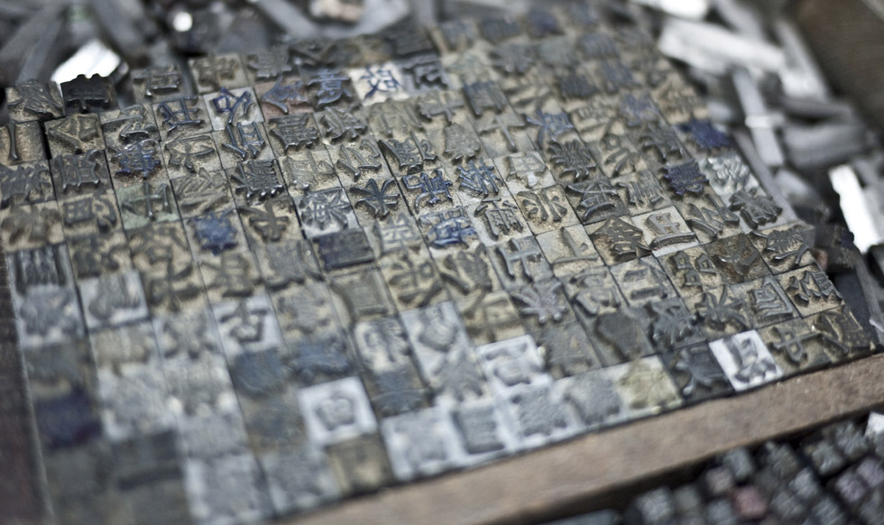
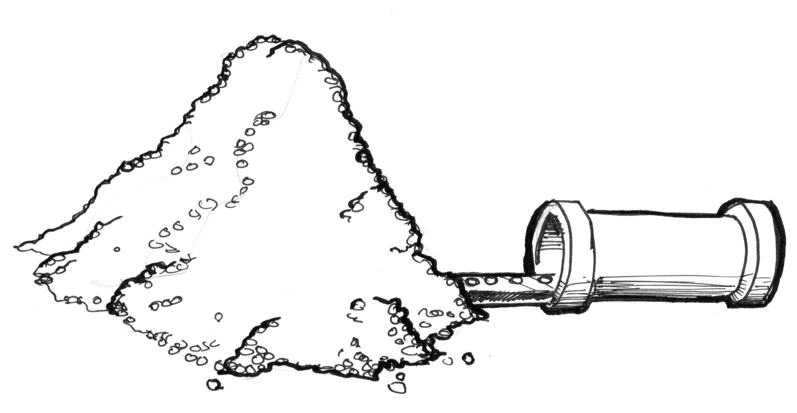

# Getting started
# 初めの一歩
## What is a fragment shader?
## フラグメントシェーダーとは

In the previous chapter we described shaders as the equivalent of the Gutenberg press for graphics. Why? And more importantly: what's a shader?

前の章ではシェーダーがグーテンベルグの活版印刷に匹敵すると言いました。どういう意味でしょう。そもそもシェーダーとはなんでしょうか。

If you already have experience making drawings with computers, you know that in that process you draw a circle, then a rectangle, a line, some triangles until you compose the image you want. That process is very similar to writing a letter or a book by hand - it is a set of instructions that do one task after another.

コンピュータで絵を描いたことがあれば、円や長方形、線、三角などを組み合わせて自分の描きたいものを作る方法を知っているでしょう。コンピュータへの指示ごとに手順を一つ一つ繰り返していくという意味で、これは文字や本を手で書いていく方法によく似ています。

Shaders are also a set of instructions, but the instructions are excecuted all at once for every single pixel on the screen. That means the code you write has to behave differently depending on the position of the pixel on the screen. Like a type press, your program will work as a function that receives a position and returns a color, and when it's compiled it will run extraordinarily fast.

シェーダーもコンピュータへの指示の集まりですが、全てのピクセルに対する指示が同時に実行される点が違います。そのためには書かれたコードが画面上のピクセルの位置によって違った振る舞いをする必要があります。プログラムは画面上の位置を入力にしてピクセルの色を返す関数として働き、一度組まれた活版が一度にページ印刷できるのと同じように、コンパイルされたシェーダは非常に速く処理を行うことができます。

## Why are shaders fast?
## シェーダはなぜ速いのか

To answer this, I present the wonders of *parallel processing*.

Imagine the CPU of your computer as a big industrial pipe, and every task as something that passes through it - like a factory line. Some tasks are bigger than others, which means they require more time and energy to deal with. We say they require more processing power. Because of the architecture of computers the jobs are forced to run in a series; each job has to be finished one at a time. Modern computers usually have groups of four processors that work like these pipes, completing tasks one after another to keeping things running smoothly. Each pipe is also known as *thread*.

秘密は並行処理にあります。

コンピュータのCPUを太い土管のようなパイプだと想像してみてください。全てのタスクは工場のようにパイプを通って流れて行きます。幾つかのタスクは他のものよりも大きくて、より多くのエネルギー、つまりコンピュータの処理能力を必要とします。コンピュータは仕事を順番に扱いひとつずつ終わらせていくように設計されています。最近のコンピュータはたいていこのパイプの役割をするプロセッサーを四つセットで持っていて、タスクを一つ一つ、全体がスムースに流れるように終わらせていきます。このパイプはスレッドとも呼ばれています。（訳注：CPU=パイプ=スレッドのように読めますが、実際にはスレッドはCPUを通る処理の単位として分けて考えた方が正確だと思います。[Wikipedia:スレッド (コンピュータ)](https://ja.wikipedia.org/wiki/%E3%82%B9%E3%83%AC%E3%83%83%E3%83%89_(%E3%82%B3%E3%83%B3%E3%83%94%E3%83%A5%E3%83%BC%E3%82%BF)参照。この後の方にも同様の部分が出てきますがだいたい言いたいことは伝わると思うのでそのままにしておきます。)

Video games and other graphic applications require a lot more processing power than other programs. Because of their graphic content they have to do huge numbers of pixel-by-pixel operations. Every single pixel on the screen needs to be computed, and in 3D games geometries and perspectives need to be calculated as well.

ビデオゲームや画像を扱うアプリケーションは他のプログラムに比べてずっと多くの処理能力を必要とします。画像コンテンツのために非常に多くの処理をピクセルごとに行わなくてはならないためです。全てのピクセルは計算を必要とし、3Dのゲームではさらにオブジェクトの形状や遠近法のための計算も必要になります。

Let's go back to our metaphor of the pipes and tasks. Each pixel on the screen represents a simple small task. Individually each pixel task isn't an issue for the CPU, but (and here is the problem) the tiny task has to be done to each pixel on the screen! That means in an old 800x600 screen, 480,000 pixels have to processed per frame which means 14,400,000 calculations per second! Yes! That’s a problem big enough to overload a microprocessor. In a modern 2880x1800 retina display running at 60 frames per second that calculation adds up to 311,040,000 calculations per second. How do graphics engineers solve this problem?

パイプとタスクの比喩を思い出しましょう。それぞれのピクセルは小さくて簡単なタスクです。個々のピクセルはCPUにとってなんの問題もありません。でもこの小さなタスクは画面上の全部のピクセルに対して処理されなくてはなりません。古い800x600のスクリーンなら480,000個のピクセルを処理する必要があり、一秒あたりの計算は14,400,000回になります（訳注：秒間30フレームの場合）。これは一個のプロセッサーには重たい仕事です。今時の2880x1800あるレティーナディスプレイで秒間60フレームだと、311,040,000回にもなります。グラフィックエンジニアはどうやってこれを解決するのでしょう。

This is when parallel processing becomes a good solution. Instead of having a couple of big and powerful microprocessors, or *pipes*, it is smarter to have lots of tiny microprocessors running in parallel at the same time. That’s what a Graphic Processor Unit (GPU) is.

ここで並行処理です。数個の大きくて強力なプロセッサー（パイプ）の代わりに、同時に働くことのできるたくさんの小さなプロセッサーを使うのが賢いやりかたです。これがGPU(Graphic Processor Unit)の正体です。

Picture the tiny microprocessors as a table of pipes, and the data of each pixel as a ping pong ball. 14,400,000 ping pong balls a second can obstruct almost any pipe. But a table of 800x600 tiny pipes receiving 30 waves of 480,000 pixels a second can be handled smoothly. This works the same at higher resolutions - the more parallel hardware you have, the bigger the stream it can manage.

たくさんの小さいプロセッサーをパイプをずらりと並列に並べたもの、ピクセルごとのデータはピンポン玉だと想像してみてください。一秒あたり14,400,000個のピンポン玉を流せばどんなパイプでも詰まってしまいますが、800x600本の小さいパイプなら480,000個を一秒間に30回スムースに流すことができます。
解像度が大きくなっても理屈は同じです。並列に処理できる数が多いほど、より大きなデータの流れを扱うことができるのです。

Another “super power” of the GPU is special math functions accelerated via hardware, so complicated math operations are resolved directly by the microchips instead of by software. That means extra fast trigonometrical and matrix operations - as fast as electricity can go.

もうひとつGPUの凄いところは、特定の数学的な関数がハードウェアで高速に処理されることです。複雑な計算がソフトウェアではなく直接チップによって処理されるので、三角関数や行列演算を非常に速く行うことができます。

## What is GLSL?
## GLSLとは

GLSL stands for openGL Shading Language, which is the specific standard of shader programs you'll see in the following chapters. There are other types of shaders depending on hardware and Operating Systems. Here we will work with the openGL specs regulated by [Khronos Group](https://www.khronos.org/opengl/). Understanding the history of OpenGL can be helpful for understanding most of its weird conventions, for that I recommend taking a look at: [openglbook.com/chapter-0-preface-what-is-opengl.html](http://openglbook.com/chapter-0-preface-what-is-opengl.html)

GLSLはopenGL Shading Languageの略で、標準化されたシェーディング言語の一つで、ここからの章ではこの言語を扱います。他にもハードやOSによって異なるシェーダー言語があります。
ここからは[クロノスグループ](https://www.khronos.org/opengl/)によって策定されたopenGLの仕様に基づいて話を進めます。歴史を知っておくとOpenGLの奇妙な慣習を理解する助けになるかもしれないので、[openglbook.com/chapter-0-preface-what-is-opengl.html](http://openglbook.com/chapter-0-preface-what-is-opengl.html)を見ておくことをお勧めします。

## Why are Shaders famously painful?
## なんでシェーダーは厄介だと思われているのか

As Uncle Ben said “with great power comes great responsibility,” and parallel computation follows this rule; the powerful architectural design of the GPU comes with its own constraints and restrictions.

スパイダーマンの父親がわりだったベンおじさんが「大いなる力には、大いなる責任が伴う」と言い残しましたが、並列処理にもそれが当てはまります。強力なGPUの設計にはそれに応じた制約と制限があります。

In order to run in parallel every pipe, or thread, has to be independent from every other thread. We say the threads are *blind* to what the rest of the threads are doing. This restriction implies that all data must flow in the same direction. So it’s impossible to check the result of another thread, modify the input data, or pass the outcome of a thread into another thread. Allowing thread-to-thread communications puts the integrity of the data at risk.

全てのパイプ、またはスレッドを並列で走らせるためには、それぞれが他のスレッドから独立していなければなりません。つまりスレッドにはほかのスレッドがしていることが見えないのです。全てのデータが同じ向きに流れなくてはならず、ほかのスレッドの結果をチェックしたり、入力データを変えたり、あるスレッドの結果を別のスレッドに渡したりすることはできないのです。スレッド間のやりとりを可能にしてしまうと、データ全体としての一貫した処理を損なうことになりかねません。

Also the GPU keeps the parallel micro-processor (the pipes) constantly busy; as soon as they get free they receive new information to process. It's impossible for a thread to know what it was doing in the previous moment. It could be drawing a button from the UI of the operating system, then rendering a portion of sky in a game, then displaying the text of an email. Each thread is not just **blind** but also **memoryless**. Besides the abstraction required to code a general function that changes the result pixel by pixel depending on its position, the blind and memoryless constraints make shaders not very popular among beginning programmers.

GPUは並列なプロセッサーをずっと忙しいまま保とうとします。仕事が終わったプロセッサーはすぐに新しい処理のための情報を受け取ることになります。スレッドは前の瞬間にやっていたことを覚えていません。OSのUI上のボタンを描いていたかと思えば次の瞬間にはゲームの中の空の一部を、次にはメールの文章を描いているかもしれません。スレッドには周りが見えないだけでなく、記憶もないのです。ピクセルの位置に応じて結果を変えられるような汎用的な関数を書くために考えをうまく取りまとる必要があることに加えて、ほかのスレッドや前の状態がわからないという制限のおかげでシェーダーはプログラム初心者にはあまり人気がありません。

Don't worry! In the following chapters, we will learn step-by-step how to go from simple to advanced shading computations. If you are reading this with a modern browser, you will appreciate playing with the interactive examples. So let's not delay the fun any longer and press *Next >>* to jump into the code!

でも大丈夫。この後につづく章では簡単なことから高度なシェーディングまで一歩一歩学んでいきます。今時のブラウザーで読んでいれば、サンプルを試してみることがとても役にたつでしょう。さあ楽しいことをこれ以上後回しにするのはやめて、「Next」を押してコーディングを始めましょう。
