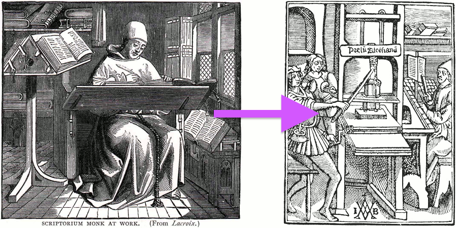

# 初めの一歩

## シェーダーとは？

前章ではシェーダーがグーテンベルグの活版印刷に匹敵すると書きました。どういう意味でしょう。そもそもシェーダーとは何でしょうか。

コンピュータで絵を描いた経験があれば、円や長方形、線、三角などを組み合わせて自分の描きたいものを作る方法を知っているでしょう。コンピュータへ順を追って指示をしていくという意味で、これは本を一文字一文字書いていく方法によく似ています。

シェーダーもコンピュータへの指示の集まりですが、全てのピクセルに対する指示が同時に実行される点が違います。そのためには書かれたコードが画面上のピクセルの位置によって違った振る舞いをする必要があります。プログラムは画面上の位置を入力としてピクセルの色を返す関数として働き、まとめて組まれた版が一度にページを印刷できるのと同じように、コンパイルされたシェーダーは桁外れに速く処理を行うことができます。

## シェーダーはなぜ速いのか

その秘密は並列処理にあります。

コンピュータのCPUを太いパイプだと想像してみてください。全てのタスクは工場のようにパイプを通って流れて行きます。幾つかのタスクは他のものよりも大きくて、より多くのエネルギー、つまりコンピュータの処理能力を必要とします。コンピュータは仕事を順番に扱い、ひとつずつ終わらせていくように設計されています。最近のコンピュータはたいていパイプの役割をするプロセッサーを四つセットで持っていて、タスクを一つ一つ、全体がスムーズに流れるように終わらせていきます。このパイプはスレッドとも呼ばれています。（訳注：CPU=パイプ=スレッドのように読めますが、実際にはスレッドはCPUを通る処理の単位として分けて考えた方が正確だと思います。[Wikipedia: スレッド (コンピュータ)](https://ja.wikipedia.org/wiki/%E3%82%B9%E3%83%AC%E3%83%83%E3%83%89_(%E3%82%B3%E3%83%B3%E3%83%94%E3%83%A5%E3%83%BC%E3%82%BF)) 参照。この後の方にも同様の部分が出てきますがおよその意味は通じると思うのでそのまま訳します。)

ビデオゲームや画像を扱うアプリケーションは他のプログラムに比べてかなり多くの処理能力を必要とします。画像コンテンツのために非常に多くの処理をピクセルごとに行わなくてはならないのです。全てのピクセルは計算を必要とし、3Dのゲームではさらに、オブジェクトの形状や遠近法のための計算も必要になります。

パイプとタスクの比喩を思い出しましょう。それぞれのピクセルは小さくて簡単なタスクです。個々のピクセルはCPUにとってなんの問題もありません。でもこの小さなタスクは画面上の全部のピクセルの分だけあるのです！昔の800x600pxのスクリーンなら480,000個のピクセルを処理する必要があり、一秒あたりの計算は14,400,000回になります（訳注：秒間30フレームの場合）。これは一個のプロセッサーにはかなりの負荷になります。2880x1800pxもある今時のRatina ディスプレイで秒間60フレームでは、311,040,000回にもなります。グラフィックエンジニアはどうやってこれを解決するのでしょう。

ここで並列処理の出番です。いくつかの大きくて強力なプロセッサー（パイプ）の代わりに、たくさんの小さなプロセッサーを同時に働かせるのが賢いやりかたです。これがGPU(Graphic Processor Unit)の正体です。

たくさんの小さなプロセッサーをパイプをずらりと並列に並べたものに、ピクセルごとのデータをピンポン玉だと想像してみてください。一秒に14,400,000個のピンポン玉を流せばどんなパイプでも詰まってしまいますが、800x600本の小さいパイプなら480,000個を一秒間に30回スムーズに流すことができます。
解像度が大きくなっても理屈は同じです。並列に処理できる数が多いほど、より大きなデータの流れを扱うことができます。

さらにGPUの凄い点は、特定の数学的な関数がハードウェアで高速に処理されるということです。複雑な計算がソフトウェアではなく直接チップによって処理されるので、三角関数や行列演算を非常に速く行うことができます。

## GLSLとは

GLSLはopenGL Shading Languageの略で、標準化されたシェーダー言語の一つです。これ以降の章ではこの言語を扱います。他にもハードやOSによって異なるシェーダー言語があります。
ここからは[クロノスグループ](https://www.khronos.org/opengl/)によって策定されたOpenGLの仕様に基づいて話を進めます。OpenGLの歴史を知っておくと奇妙な（訳注：プログラミング、言語仕様上の）慣習を理解する助けになるかもしれません。[openglbook.com/chapter-0-preface-what-is-opengl.html](http://openglbook.com/chapter-0-preface-what-is-opengl.html)に軽く目を通しておくと良いでしょう。

## なぜシェーダーは厄介だと思われているのか

スパイダーマンの父親がわりだったベンおじさんは「大いなる力には、大いなる責任が伴う」と言い残しましたが、これは並列処理にも当てはまります。強力なGPUの設計の裏にはそれに応じた制約と制限があります。

全てのパイプ、またはスレッドを並列で走らせるためには、それぞれが他のスレッドから独立していなければなりません。つまりスレッドにはほかのスレッドがしていることが見えないのです。全てのデータが同じ向きに流れなくてはならず、ほかのスレッドの結果をチェックしたり、入力データを変えたり、あるスレッドの結果を別のスレッドに渡したりすることはできないのです。スレッド間のやりとりを可能にしてしまうと、データ全体としての一貫した処理を損なうことになりかねません。

GPUは並列なプロセッサーを常に忙しく働かせようとします。仕事が終わったプロセッサーはすぐに新しい処理のための情報を受け取ります。スレッドは前の瞬間にやっていたことを覚えていません。OSのUI上のボタンを描いていたかと思えばゲームの中の空の一部を、次にはメールの文章の表示をしているかもしれません。スレッドには周りが見えないだけでなく、記憶もないのです。ピクセルの位置に応じて結果を変えられるような汎用的な関数をうまくまとめる必要があることに加えて、ほかのスレッドや前の状態がわからないという制限のおかげで、シェーダーはプログラム初心者にはあまり人気がありません。

でも大丈夫です！この後につづく章では簡単なものから高度なシェーディングまで一歩一歩学んでいきます。今時のブラウザをお使いであれば、サンプルコードも試してみることができます。さあ、楽しいことを先延ばしににするのはやめて、「Next」を押してコーディングを始めましょう。
