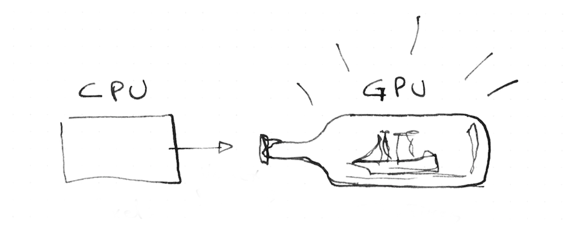

## Uniforms

So far we have seen how the GPU manages large numbers of parallel threads, each one responsible for assigning the color to a fraction of the total image. Although each parallel thread is blind to the others, we need to be able to send some inputs from the CPU to all the threads. Because of the architecture of the graphic card those inputs are going to be equal (*uniform*) to all the threads and necessarily set as *read only*. In other words, each thread receives the same data which it can read but cannot change. 

These inputs are call ```uniform``` and come in most of the supported types: ```float```, ```vec2```, ```vec3```, ```vec4```, ```mat2```, ```mat3```, ```mat4```, ```sampler2D``` and ```samplerCube```. Uniforms are defined with the corresponding type at the top of the shader right after assigning the default floating point precision.

```glsl
#ifdef GL_ES
precision mediump float;
#endif

uniform vec2 u_resolution; // Canvas size (width,height)
uniform vec2 u_mouse;      // mouse position in screen pixels
uniform float u_time;	  // Time in seconds since load 
```

You can picture the uniforms like little bridges between the CPU and the GPU. The names will vary from implementation to implementation but in this series of examples I’m always passing: ```u_time``` (time in seconds since the shader started), ```u_resolution``` (billboard size where the shader is being drawn) and ```u_mouse``` (mouse position inside the billboard in pixels). I’m following the convention of putting ```u_``` before the uniform name to be explicit about the nature of this variable but you will find all kinds of names for uniforms. For example [ShaderToy.com](https://www.shadertoy.com/) uses the same uniforms but with the following names:

```glsl
uniform vec3 iResolution;   // viewport resolution (in pixels)
uniform vec4 iMouse;        // mouse pixel coords. xy: current, zw: click
uniform float iGlobalTime;  // shader playback time (in seconds)
```

Enough talking, let's see the uniforms in action. In the following code we use ```u_time``` - the number of seconds since the shader started running - together with a sine function to animate the transition of the amount of red in the billboard.

<div class="codeAndCanvas" data="time.frag"></div>

As you can see GLSL has more surprises. The GPU has hardware accelerated angle, trigonometric and exponential functions. Some of those functions are: [```sin()```](http://www.shaderific.com/glsl-functions/#sine), [```cos()```](http://www.shaderific.com/glsl-functions/#cosine), [```tan()```](http://www.shaderific.com/glsl-functions/#tangent), [```asin()```](http://www.shaderific.com/glsl-functions/#arcsine), [```acos()```](http://www.shaderific.com/glsl-functions/#arccosine), [```atan()```](http://www.shaderific.com/glsl-functions/#arctangent), [```pow()```](http://www.shaderific.com/glsl-functions/#exponentiation), [```exp()```](http://www.shaderific.com/glsl-functions/#exponentiation), [```log()```](http://www.shaderific.com/glsl-functions/#naturallogarithm), [```sqrt()```](http://www.shaderific.com/glsl-functions/#squareroot), [```abs()```](http://www.shaderific.com/glsl-functions/#absolutevalue), [```sign()```](http://www.shaderific.com/glsl-functions/#sign), [```floor()```](http://www.shaderific.com/glsl-functions/#floor), [```ceil()```](http://www.shaderific.com/glsl-functions/#ceiling), [```fract()```](http://www.shaderific.com/glsl-functions/#fractionalpart), [```mod()```](http://www.shaderific.com/glsl-functions/#modulo), [```min()```](http://www.shaderific.com/glsl-functions/#minimum), [```max()```](http://www.shaderific.com/glsl-functions/#maximum) and [```clamp()```](http://www.shaderific.com/glsl-functions/#clamp).

Now it is time again to play with the above code.

* Slow down the frequency until the color change becomes almost imperceptible.

* Speed it up until you see a single color without flickering.

* Play with the three channels (RGB) in different frequencies to get interesting patterns and behaviors.

## gl_FragCoord

In the same way GLSL gives us a default output, ```vec4 gl_FragColor```, it also gives us a default input, ```vec4 gl_FragCoord```, which holds the screen coordinates of the *pixel* or *screen fragment* that the active thread is working on. With ```vec4 gl_FragCoord```, we know where a thread is working inside the billboard. In this case we don't call it ```uniform``` because it will be different from thread to thread, instead ```gl_FragCoord``` is called a *varying*.

<div class="codeAndCanvas" data="space.frag"></div>

In the above code we *normalize* the coordinate of the fragment by dividing it by the total resolution of the billboard. By doing this the values will go between ```0.0``` and ```1.0```, which makes it easy to map the X and Y values to the RED and GREEN channel. 

In shader-land we don’t have too many resources for debugging besides assigning strong colors to variables and trying to make sense of them. You will discover that sometimes coding in GLSL is very similar to putting ships inside bottles. Is equally hard, beautiful and gratifying.



Now it is time to try and challenge our understanding of this code.

* Can you tell where the coordinate ```(0.0,0.0)``` is in our canvas?

* What about ```(1.0,0.0)```, ```(0.0,1.0)```, ```(0.5,0.5)``` and ```(1.0,1.0)```?

* Can you figure out how to use ```u_mouse``` knowing that the values are in pixels and NOT normalized values? Can you use it to move colors around? 

* Can you imagine an interesting way of changing this color pattern using ```u_time``` and ```u_mouse``` coordinates?

After doing these exercises you might wonder where else you can try your new shader-powers. In the following chapter we will see  how to make your own shader tools in three.js, Processing, and openFrameworks.