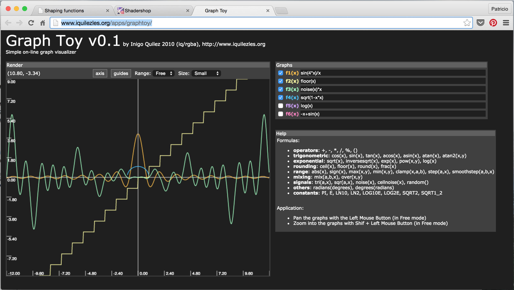

# 算法绘画
## 造型函数

这一章应该叫做宫城先生的粉刷课（来自电影龙威小子的经典桥段）。之前我们把规范化后的 x,y 坐标映射（map）到了红色和绿色通道。本质上说我们是建造了这样一个函数：输入一个二维向量（x，y)，然后返回一个四维向量（r，g，b，a）。但在我们跨维度转换数据之前，我们先从更加…更加简单的开始。我们来建一个只有一维变量的函数。你花越多的时间和精力在这上面，你的 shader 功夫就越厉害。


接下来的代码结构就是我们的基本功。在它之中我们对规范化的 x 坐标（```st.x```）进行可视化。有两种途径：一种是用亮度（度量从黑色到白色的渐变过程），另一种是在顶层绘制一条绿色的线（在这种情况下 x 被直接赋值给 y）。不用过分在意绘制函数，我们马上会更加详细地解释它。

<div class="codeAndCanvas" data="linear.frag"></div>

**简注** ：```vec3``` 类型构造器“明白”你想要把颜色的三个通道赋值到一个值里，就像 ```vec4``` 明白你想要构建一个四维向量，三维向量加上第四个值（比如颜色的三个值加上透明度）。请参照上面示例的第 20 到 26 行。

这些代码就是你的基本功；遵守和理解它非常重要。你将会一遍又一遍地回到 0.0 到 1.0 这个区间。你将会掌握融合与构建这些代码的艺术。

这些 x 与 y（或亮度）之间一对一的关系称作**线性插值**（linear interpolation）。（译者注：插值是离散函数逼近的重要方法，利用它可通过函数在有限个点处的取值状况，估算出函数在其他点处的近似值。因为对计算机来说，屏幕像素是离散的而不是连续的，计算机图形学常用插值来填充图像像素之间的空隙。）现在起我们可以用一些数学函数来改造这些代码行。比如说我们可以做一个求 x 的 5 次幂的曲线。

<div class="codeAndCanvas" data="expo.frag"></div>

很有趣，对吧？试试看把第 19 行的指数改为不同的值，比如：20.0，2.0，1.0，0.0，0.2 或 0.02。理解值和指数之间的关系非常重要。这些数学函数可以让你灵动地控制你的代码，就像是给数据做针灸一样。

[```pow()```](../glossary/?search=pow) （求x的y次幂）是 GLSL 的一个原生函数，GLSL 有很多原生函数。大多数原生函数都是硬件加速的，也就是说如果你正确使用这些函数，你的代码就会跑得更快。

换掉第 19 行的幂函数，试试看[```exp()```](../glossary/?search=exp)（以自然常数e为底的指数函数），[```log()```](../glossary/?search=log)(对数函数) 和 [```sqrt()```](../glossary/?search=sqrt)（平方根函数）。当你用 Pi 来玩的时候有些方程会变得更有趣。在第 5 行我定义了一个宏，使得每当程序调用 ```PI``` 的时候就用 ```3.14159265359``` 来替换它。
 
### Step 和 Smoothstep

GLSL 还有一些独特的原生插值函数可以被硬件加速。

[```step()```](../glossary/?search=step) 插值函数需要输入两个参数。第一个是极限或阀值，第二个是我们想要检测或通过的值。对任何小于阀值的值，返回 ```0.0```，大于阀值，则返回 ```1.0```。

试试看改变下述代码中第 20 行的值。

<div class="codeAndCanvas" data="step.frag"></div>

另一个 GLSL 的特殊函数是 [```smoothstep()```](../glossary/?search=smoothstep)。当给定一个范围的上下限和一个数值，这个函数会在已有的范围内给出插值。前两个参数规定转换的开始和结束点，第三个是给出一个值用来插值。

<div class="codeAndCanvas" data="smoothstep.frag"></div>

在之前的例子中，注意第 12 行，我们用到 smoothstep 在 ```plot()``` 函数中画了一条绿色的线。这个函数会对给出的 x 轴上的每个值，在特定的 y 值处制造一个凹凸形变。如何做到呢？通过把两个 [```smoothstep()```](../glossary/?search=smoothstep) 连接到一起。来看看下面这个函数，用它替换上面的第 20 行，把它想成是一个垂直切割。背景看起来很像一条线，不是吗？

```glsl
    float y = smoothstep(0.2,0.5,st.x) - smoothstep(0.5,0.8,st.x);
```

### 正弦和余弦函数

当你想用数学来制造动效，形态或去混合数值，sin 和 cos 就是你的最佳伙伴。

这两个基础的三角函数是构造圆的极佳工具，就像张小泉的剪刀一样称手。很重要的一点是你需要知道它们是如何运转的，还有如何把它们结合起来。简单来说，当我们给出一个角度（这里采用弧度制），它就会返回半径为一的圆上一个点的 x 坐标（[cos](../glossary/?search=cos)）和 y 坐标（[sin](../glossary/?search=sin)）。正因为 sin 和 cos 返回的是规范化的值（即值域在 -1 和 1 之间），且如此流畅，这就使得它成为一个极其强大的工具。


尽管描述三角函数和圆的关系是一件蛮困难的事情，上图动画很棒地做到了这一点，视觉化展现了它们之间的关系。

<div class="simpleFunction" data="y = sin(x);"></div>

仔细看 sin 曲线。观察 y 值是如何平滑地在 +1 和 -1 之间变化。就像之前章节关于的 time 的例子中，你可以用 [```sin()```](../glossary/?search=sin) 的有节奏的变动给其他东西加动效。如果你是在用浏览器阅读的话你可以改动上述公式，看看曲线会如何变动。(注：不要忘记每行最后要加分号！）

试试下面的小练习，看看会发生什么：

* 在 ```sin``` 里让 x 加上时间（```u_time```）。让sin 曲线随 x 轴**动起来**。

* 在 ```sin``` 里用 ```PI``` 乘以 x。注意 sin 曲线上下波动的两部分如何**收缩**了，现在 sin 曲线每两个整数循环一次。

* 在 ```sin``` 里用时间（	```u_time```)乘以 x。观察各阶段的循环如何变得越来越**频繁**。注意 u_time 可能已经变得非常大，使得图像难以辨认。

* 给 [```sin(x)```](../glossary/?search=sin)（注意不是 sin 里的 x）加 1.0。观察曲线是如何向上**移动**的，现在值域变成了 0.0 到 2.0。

* 给 [```sin(x)```](../glossary/?search=sin) 乘以 2.0。观察曲线大小如何**增大**两倍。

* 计算 ```sin(x)``` 的绝对值（[```abs()```](../glossary/?search=abs)）。现在它看起来就像一个**弹力球**的轨迹。

* 只选取 ```sin(x)``` 的小数部分（[```fract()```](../glossary/?search=fract)）。

* 使用向正无穷取整（[```ceil()```](../glossary/?search=ceil)）和向负无穷取整（[```floor()```](../glossary/?search=floor)），使得 sin 曲线变成只有 1 和 -1 的电子波。

### 其他有用的函数

最后一个练习中我们介绍了一些新函数。现在我们来一个一个试一遍。依次取消注释下列各行，理解这些函数，观察它们是如何运作的。你一定在奇怪……为什么要这么做呢？Google 一下“generative art”（生成艺术）你就知道了。要知道这些函数就是我们的栅栏。我们现在控制的是它在一维中的移动，上上下下。很快，我们就可以尝试二维、三维甚至四维了！


<div class="simpleFunction" data="y = mod(x,0.5); // 返回 x 对 0.5 取模的值
//y = fract(x); // 仅仅返回数的小数部分
//y = ceil(x);  // 向正无穷取整
//y = floor(x); // 向负无穷取整
//y = sign(x);  // 提取 x 的正负号
//y = abs(x);   // 返回 x 的绝对值
//y = clamp(x,0.0,1.0); // 把 x 的值限制在 0.0 到 1.0
//y = min(0.0,x);   // 返回 x 和 0.0 中的较小值
//y = max(0.0,x);   // 返回 x 和 0.0 中的较大值  "></div>

### 造型函数进阶

[Golan Levin](http://www.flong.com/) 写过关于更加复杂的造型函数的文档，非常有帮助。把它们引入 GLSL 是非常明智的选择，这将是你的代码的广阔的素材库

* [多项式造型函数（Polynomial Shaping Functions）: www.flong.com/texts/code/shapers_poly](http://www.flong.com/texts/code/shapers_poly/)

* [指数造型函数（Exponential Shaping Functions）: www.flong.com/texts/code/shapers_exp](http://www.flong.com/texts/code/shapers_exp/)

* [圆与椭圆的造型函数（Circular & Elliptical Shaping Functions）: www.flong.com/texts/code/shapers_circ](http://www.flong.com/texts/code/shapers_circ/)

* [贝塞尔和其他参数化造型函数（Bezier and Other Parametric Shaping Functions）: www.flong.com/texts/code/shapers_bez](http://www.flong.com/texts/code/shapers_bez/)

就像厨师自主选择辣椒和各种原料，数字艺术家和创意编程者往往钟情于使用他们自己的造型函数。

[Iñigo Quiles](http://www.iquilezles.org/) 收集了一套[有用的函数](http://www.iquilezles.org/www/articles/functions/functions.htm)。在看过[这篇文章](http://www.iquilezles.org/www/articles/functions/functions.htm)后，看看下列函数转换到 GLSL 的样子。注意那些细小的改变，比如给浮点数（float)加小数点“.”，给“C 系函数”换成它们在 GLSL 里的名字，比如不是用 ```powf()``` 而是用 ```pow()```：

* [Impulse](../edit.html#05/impulse.frag)
* [Cubic Pulse](../edit.html#05/cubicpulse.frag)
* [Exponential Step](../edit.html#05/expstep.frag)
* [Parabola](../edit.html#05/parabola.frag)
* [Power Curve](../edit.html#05/pcurve.frag)

给你们看些东西刺激一下斗志，这里有一个非常优雅的例子（作者是 [Danguafer](https://www.shadertoy.com/user/Danguafer)，造型函数的空手道黑带）。

<iframe width="800" height="450" frameborder="0" src="https://www.shadertoy.com/embed/XsXXDn?gui=true&t=10&paused=true" allowfullscreen></iframe>

在下一章我们会有一些新的进展。我们会先混合各种颜色，然后画些形状。

#### 练习

来看看 [Kynd](http://www.kynd.info/log/) 帮大家制作的公式表。看他如何结合各种函数及它们的属性，始终控制值的范围在 0.0 到 1.0。好了，现在是你自己练习的时候了！来试试这些函数，记住：熟能生巧。


#### 填充你的工具箱

这里有一些工具可以帮你更轻松地可视化这些函数。

* Grapher：如果你是用 MacOS 系统，用 spotlight 搜 ```grapher``` 就会看到这个超级方便的工具了。


* [GraphToy](http://www.iquilezles.org/apps/graphtoy/)：仍然是 [Iñigo Quilez](http://www.iquilezles.org) 为大家做的工具，用于在 WebGL 中可视化 GLSL 函数。



* [Shadershop](http://tobyschachman.com/Shadershop/)：这个超级棒的工具是 [Toby Schachman](http://tobyschachman.com/) 的作品。它会以一种极其视觉化和直观的方式教你如何建造复杂的函数。


