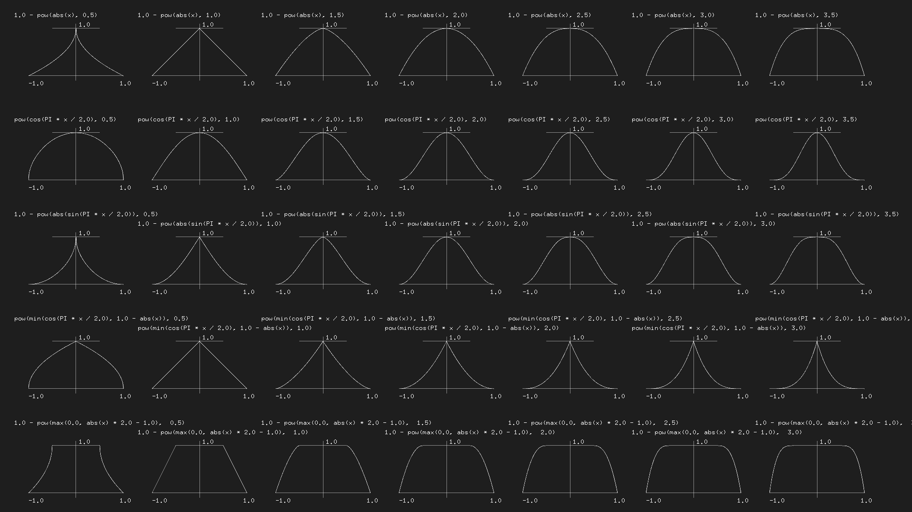
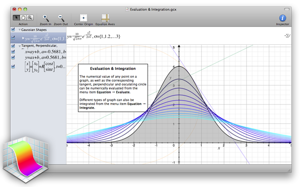
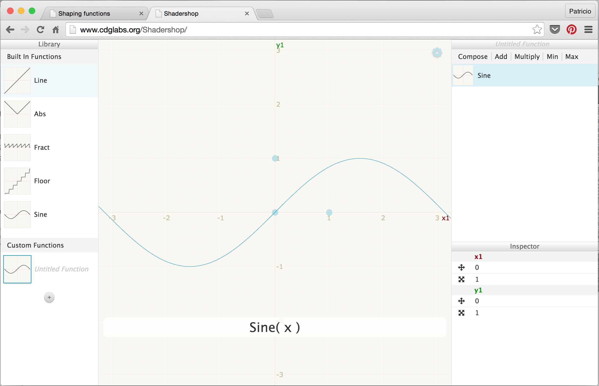

# Algorithmic drawing
# アルゴリズムで絵を描く

## Shaping functions
## シェーピング関数

This chapter could be named "Mr. Miyagi's fence lesson." Previously, we mapped the normalized position of *x* and *y* to the *red* and *green* channels. Essentially we made a function that takes a two dimensional vector (x and y) and returns a four dimensional vector (r, g, b and a). But before we go further transforming data between dimensions we need to start simpler... much simpler. That means understanding how to make one dimensional functions. The more energy and time you spend learning and mastering this, the stronger your shader karate will be.

この章は[「ミヤギさんの壁塗りレッスン」](https://ja.wikipedia.org/wiki/%E3%83%99%E3%82%B9%E3%83%88%E3%83%BB%E3%82%AD%E3%83%83%E3%83%89)とでもすれば良かったかもしれません。三章では正規化したx座標とy座標の値をr（赤）とg（緑）のチャンネルに割り当てました。つまり私たちは既に、二次元のベクトル（xとy）を受け取って四次元のベクトル（r、g、b、a）を返す関数を作ったのです。
しかし、次元をまたいでのデータの変形にさらに深く踏み込む前に、ずっとシンプルなことから修行を始めなければなりません。まずは一次元の関数を理解します。より多くの時間と労力を割いて鍛錬すれば、その分だけあなたのシェーダーカラテは強くなるでしょう。


The following code structure is going to be our fence. In it, we visualize the normalized value of the *x* coordinate (```st.x```) in two ways: one with brightness (observe the nice gradient from black to white) and the other by plotting a green line on top (in that case the *x* value is assigned directly to *y*). Don't focus too much on the plot function, we will go through it in more detail in a moment.

私たちにとってのミヤギさんの壁に当たるのは、下記に示すコードの枠組みです。この枠組みを使って、正規化されたx座標の値を2種類の方法で目に見えるようにしてみます。1つめの方法では色の明るさを使い（黒から白への綺麗なグラデーションを見てください）、2つめでは緑色の線を描画しています（ここではx座標の値をそのままy座標に割り当てています）。plot関数のことは今はあまり気にしないでください。すぐ後で詳しく説明します。

<div class="codeAndCanvas" data="linear.frag"></div>

**Quick Note**: The ```vec3``` type constructor "understands" that you want to assign the three color channels with the same value, while ```vec4``` understands that you want to construct a four dimensional vector with a three dimensional one plus a fourth value (in this case the value that controls the alpha or opacity). See for example lines 20 and 26 above.

上記のサンプルの20行目と26行目を見てください。
```vec3```型のコンストラクタは、値を1つだけ受け取ると3つの色のチャンネルに同じ値を割りてようとしているのだと理解してくれます。また```vec4```は三次元のベクトルともう一つの値（ここではalpha、つまり透明度）で初期化されています。

This code is your fence; it's important to observe and understand it. You will come back over and over to this space between *0.0* and *1.0*. You will master the art of blending and shaping this line.

このコードがミヤギさんの壁です。よく観察して理解しておくことが大切です。この*0.0*から*1.0*の空間には何度も立ち戻ってくることになるでしょう。そしてあなたはいずれ色の調合と形を生み出す技をマスターするのです。

This one-to-one relationship between  *x* and *y* (or the brightness) is know as *linear interpolation*. From here we can use some mathematical functions to *shape* the line. For example we can raise *x* to the power of 5 to make a *curved* line.

このサンプルのx座標と明るさ、またはx座標とy座標の1対1の対応は線形補間と呼ばれています。（訳注：原文だと判りにくいのですが、ここではx=0.0からx=1.0の間のグラフが一次方程式で書ける、つまりグラフが直線になることを指して線形補完という言葉を使っています。参考：[Wikipedia: 線形補間](https://ja.wikipedia.org/wiki/%E7%B7%9A%E5%BD%A2%E8%A3%9C%E9%96%93)）。
ここから私たちは数学的な関数を使って線を形作っていくことになります。例えばxを5乗すれば曲線を作ることができます。

<div class="codeAndCanvas" data="expo.frag"></div>

Interesting, right? On line 19 try different exponents: 20.0, 2.0, 1.0, 0.0, 0.2 and 0.02 for example. Understanding this relationship between the value and the exponent will be very helpful. Using these types of mathematical functions here and there will give you expressive control over your code, a sort of data acupuncture that let you control the flow of values.

面白いでしょう？ 19行目の指数（5.0）を他の数に変えてみましょう。例えば値を20.0, 2.0, 1.0, 0.0, 0.2, 0.02に変えてみます。この値と指数の関係を理解しておくととても役に立ちます。この例のように数学的な関数を様々な場面で用いることで、コードを表現豊かに操ることができます。気の流れのかわりにデータの流れを操る針の技といったところです。

[```pow()```](../glossary/?search=pow) is a native function in GLSL and there are many others. Most of them are accelerated at the level of the hardware, which means if they are used in the right way and with discretion they will make your code faster.

GLSLには多くのネイティブ関数が用意されており、[```pow()```](../glossary/?search=pow)はその中の1つです。ほとんどのネイティブ関数はハードウェアのレベルで高速に処理されるので、よく考えて正しく使えばより速いコードを書くことができます。

Replace the power function on line 19. Try other ones like: [```exp()```](../glossary/?search=exp), [```log()```](../glossary/?search=log) and [```sqrt()```](../glossary/?search=sqrt). Some of these functions are more interesting when you play with them using PI. You can see on line 5 that I have defined a macro that will replace any call to ```PI``` with the value ```3.14159265359```.

19行目の指数関数を他の関数で置き換えてみましょう。他の例、例えば[```exp()```](../glossary/?search=exp)、[```log()```](../glossary/?search=log)、[```sqrt()```](../glossary/?search=sqrt)などを試してみましょう。このうちの幾つかはPI（パイ、円周率）を使うとより面白い結果が得られます。5行目には全ての```PI```の呼び出しを```3.14159265359```に置き換えるマクロを定義しておきました。

### Step and Smoothstep
### StepとSmoothstep

GLSL also has some unique native interpolation functions that are hardware accelerated.
GLSLには他にも幾つか、ハードウェアで高速に処理されるネィティブの補間関数があります。

The [```step()```](../glossary/?search=step) interpolation receives two parameters. The first one is the limit or threshold, while the second one is the value we want to check or pass. Any value under the limit will return ```0.0``` while everything above the limit will return ```1.0```.

[```step()```](../glossary/?search=step)補完は2つのパラメーターを受け取ります。1つめは境界または閾値で、2つめはこの関数によってチェックされる値です。境界より小さい値は全て```0.0```を返し、境界以上の値は```1.0```を返します。

Try changing this threshold value on line 20 of the following code.
下記のコードの20行めの閾値を変えて試してみてください。

<div class="codeAndCanvas" data="step.frag"></div>

The other unique function is known as [```smoothstep()```](../glossary/?search=smoothstep). Given a range of two numbers and a value, this function will interpolate the value between the defined range. The two first parameters are for the beginning and end of the transition, while the third is for the value to interpolate.

もう1つ、[```smoothstep()```](../glossary/?search=smoothstep)と呼ばれる関数があります。2つの数値からなる範囲と1つの値を受け取ると、この関数はその範囲の間の値を補完します。最初の2つのパラメータは変化の起こる範囲の始まりと終わりで、3つめのパラメータは補完される値です。

<div class="codeAndCanvas" data="smoothstep.frag"></div>

In the previous example, on line 12, notice that we’ve been using smoothstep to draw the green line on the ```plot()``` function. For each position along the *x* axis this function makes a *bump* at a particular value of *y*. How? By connecting two [```smoothstep()```](../glossary/?search=smoothstep) together. Take a look at the following function, replace it for line 20 above and think of it as a vertical cut. The background does look like a line, right?

上記の例の12行めでは、smoothstepが```plot()```関数の中で緑色の線を描画するために使われています。この関数はx軸に沿った各点で特定のyの値に対して急激に高い値を返します。どうなっているのでしょう。2つの [```smoothstep()```](../glossary/?search=smoothstep)を組み合わせています。下記の関数を見てください。この関数で上の20行目を置き換えて、結果を垂直の断面だと考えてみましょう。背景が線のように見えるでしょう？
（訳注：ここの説明はちょっと分かりにくいですね。plot関数を理解するには12行めの引き算の片側を消して```smoothstep( pct-0.02, pct, st.y)```もしくは```smoothstep( pct, pct+0.02, st.y)```だけにしてみるのも良いと思います。）

```glsl
    float y = smoothstep(0.2,0.5,st.x) - smoothstep(0.5,0.8,st.x);
```

### Sine and Cosine
### サインとコサイン

When you want to use some math to animate, shape or blend values, there is nothing better than being friends with sine and cosine.

数学を使ってアニメーションや形を作ったり値を組み合わせたりしたいのであれば、サインとコサインに親しんでおくに越したことはありません。

These two basic trigonometric functions work together to construct circles that are as handy as MacGyver’s Swiss army knife. It’s important to know how they behave and in what ways they can be combined. In a nutshell, given an angle (in radians) they will return the correct position of *x* ([cosine](../glossary/?search=cos)) and *y* ([sine](../glossary/?search=sin)) of a point on the edge of a circle with a radius equal to 1. But, the fact that they return normalized values (values between -1 and 1) in such a smooth way makes them an incredible tool.

この２つの基本的な三角関数を一緒に使うと円を作ることができます。[冒険野郎マクガイバー](https://ja.wikipedia.org/wiki/%E5%86%92%E9%99%BA%E9%87%8E%E9%83%8E%E3%83%9E%E3%82%AF%E3%82%AC%E3%82%A4%E3%83%90%E3%83%BC)のスイスアーミーナイフ並みに便利です。この２つの関数がどのように振る舞い、どのように組み合わせることができるのかを知っておくことが大事です。簡単に言うと、これらの関数は（ラジアンを単位として）角度を受け取り、半径を1とする円周上の点のx座標 ([cosine](../glossary/?search=cos)) とy座標([sine](../glossary/?search=sin)) を返します。滑らかに変化する正規化された値（-1から1の間の値）を返す性質のおかげでこれらの関数は驚くほど便利な道具になります。


While it's difficult to describe all the relationships between trigonometric functions and circles, the above animation does a beautiful job of visually summarizing these relationships.

三角関数と円の関係について全てを言葉で説明するのは難しいのですが、上のアニメーションは目でみてわかる見事な要約になっています。

<div class="simpleFunction" data="y = sin(x);"></div>

Take a careful look at this sine wave. Note how the *y* values flow smoothly between +1 and -1. As we saw in the time example in the previous chapter, you can use this rhythmic behavior of [```sin()```](../glossary/?search=sin) to animate properties. If you are reading this example in a browser you will see that the you can change the code in the formula above to watch how the wave changes. (Note: don't forget the semicolon at the end of the lines.)

このサインカーブをよく見てください。y座標の値が+1から-1の間をスムーズに上下しているのが分かるでしょう。前章の時間を使ったサンプルでも見たとおり、この[```sin()```](../glossary/?search=sin)の周期的な振る舞いをアニメーションにつかう事ができます。もしブラウザで読んでいるのであれば、上のサンプルの数式を書き換えることで波の動きを変えてみることができます（行の最後のセミコロンを忘れないようにしてください）。

Try the following exercises and notice what happens:
下記の課題を試して何が起きるか見てみましょう。

* Add time (```u_time```) to *x* before computing the ```sin```. Internalize that **motion** along *x*.
* ```sin```を計算する前に時間の値(```u_time```)をxに足してみましょう。x座標にそった動きのコントロールを自分のものにしましょう。

* Multiply *x* by ```PI``` before computing the ```sin```. Note how the two phases **shrink** so each cycle repeats every 2 integers.
* ```sin```を計算する前に```PI```をxに掛けてみましょう。波の幅が縮まってxが2進むごとにyが1サイクル上下するようになったことを確認しましょう。

* Multiply time (```u_time```) by *x* before computing the ```sin```. See how the **frequency** between phases becomes more and more compressed. Note that u_time may have already become very large, making the graph hard to read.
* ```sin```を計算する前に時間の値(```u_time```)をxに掛けてみましょう。周波数が次第に増えて波の幅が狭くなっていく様子を見てください。u_timeが既に大きくなりすぎていてグラフが読めないほどになってしまっているかもしれないので注意してください。（訳注：もしグラフが線ではなく黒い靄のようなノイズになってしまう場合は、一度ページをリロードしてからもう一度試してください。u_timeはページを読み込んでからの累積時間なので、ここまで読み進める間にかなり大きな値になっている可能性があります）。

* Add 1.0 to [```sin(x)```](../glossary/?search=sin). See how all the wave is **displaced** up and now all values are between 0.0 and 2.0.
* [```sin(x)```](../glossary/?search=sin)に1.0を足してみましょう。値が0.0から2.0の間に収まるように波が縦にずれる様子を見てください。

* Multiply [```sin(x)```](../glossary/?search=sin) by 2.0. See how the **amplitude** doubles in size.

* [```sin(x)```](../glossary/?search=sin)に2.0を掛けてみましょう。振幅が倍になります。

* Compute the absolute value ([```abs()```](../glossary/?search=abs)) of ```sin(x)```. It looks like the trace of a **bouncing** ball.
* ```sin(x)```の([```abs()```](../glossary/?search=abs))を計算してください。弾むボールの軌跡のように見えるでしょう。

* Extract just the fraction part ([```fract()```](../glossary/?search=fract)) of the resultant of [```sin(x)```](../glossary/?search=sin).
* ([```fract()```](../glossary/?search=fract))を使って[```sin(x)```](../glossary/?search=sin)の値から少数部分だけを取り出してみましょう。

* Add the higher integer ([```ceil()```](../glossary/?search=ceil)) and the smaller integer ([```floor()```](../glossary/?search=floor)) of the resultant of [```sin(x)```](../glossary/?search=sin) to get a digital wave of 1 and -1 values.

* [```sin(x)```](../glossary/?search=sin)の値を超える最小の整数([```ceil()```](../glossary/?search=ceil))と、それより小さい最大の整数([```floor()```](../glossary/?search=floor)) を足して、1と-1だけからなるデジタルな波を作ってみましょう。

### Some extra useful functions
### 便利な関数あれこれ

At the end of the last exercise we introduced some new functions. Now it’s time to experiment with each one by uncommenting the lines below one at a time. Get to know these functions and study how they behave. I know, you are wondering... why? A quick google search on "generative art" will tell you. Keep in mind that these functions are our fence. We are mastering the movement in one dimension, up and down. Soon, it will be time for two, three and four dimensions!

課題の中でいくつかの新しい関数を紹介しました。今度は下記のサンプルのコメントを1つ1つ外して実験してみましょう。それぞれの関数がどのような振る舞いをするか調べて理解しておいてください。どうしてこんなことが必要なのかと思っていますね？ Googleで"generative art"を検索すれば答えがわかります。この関数たちは私たちにとっての宮城さんの壁です。今は一次元、上下の動きをマスターしつつあります。すぐに2次元、3次元、そして4次元についても学んでいきます。


<div class="simpleFunction" data="y = mod(x,0.5); // return x modulo of 0.5
//y = fract(x); // return only the fraction part of a number
//y = ceil(x);  // nearest integer that is greater than or equal to x
//y = floor(x); // nearest integer less than or equal to x
//y = sign(x);  // extract the sign of x
//y = abs(x);   // return the absolute value of x
//y = clamp(x,0.0,1.0); // constrain x to lie between 0.0 and 1.0
//y = min(0.0,x);   // return the lesser of x and 0.0
//y = max(0.0,x);   // return the greater of x and 0.0 "></div>

### Advance shaping functions
### より高度なシェイピング関数

[Golan Levin](http://www.flong.com/) has great documentation of more complex shaping functions that are extraordinarily helpful. Porting them to GLSL is a really smart move, to start builidng your own resource of snippets of code.
[Golan Levin](http://www.flong.com/)（Golan Levin）が書いた非常に役立つ、より複雑なシェイピング関数についての素晴らしいドキュメントがあります。これ元にGLSLに移植して、自分のためのスニペット集を作ってみると良いでしょう。

* [Polynomial Shaping Functions: www.flong.com/texts/code/shapers_poly](http://www.flong.com/texts/code/shapers_poly/)

* [Exponential Shaping Functions: www.flong.com/texts/code/shapers_exp](http://www.flong.com/texts/code/shapers_exp/)

* [Circular & Elliptical Shaping Functions: www.flong.com/texts/code/shapers_circ](http://www.flong.com/texts/code/shapers_circ/)

* [Bezier and Other Parametric Shaping Functions: www.flong.com/texts/code/shapers_bez](http://www.flong.com/texts/code/shapers_bez/)

Like chefs that collect spices and exotic ingredients, digital artists and creative coders have a particular love of working on their own shaping functions.

スパイスや珍しい食材を集めるシェフのように、デジタルアーティストやクリエィティブコーダーは自分自身のシェイピング関数を考えるのが大好きです。

[Iñigo Quiles](http://www.iquilezles.org/) has a great collection of [useful functions](http://www.iquilezles.org/www/articles/functions/functions.htm). After reading [this article](http://www.iquilezles.org/www/articles/functions/functions.htm) take a look at the following translation of these functions to GLSL. Pay attention to the small changes required, like putting the "." (dot) on floating point numbers and using the GLSL name for *C functions*; for example instead of ```powf()``` use ```pow()```:

[Iñigo Quiles](http://www.iquilezles.org/)は[便利な関数の素晴らしいコレクション](http://www.iquilezles.org/www/articles/functions/functions.htm)を持っています. [この記事](http://www.iquilezles.org/www/articles/functions/functions.htm)をまず読んで、それから下記にあるGLSLへの翻訳を見てみましょう。浮動小数点の数値に「.」（小数点）を追加したり、```powf()```の代わりに```pow()```をつかうなど、Cの関数をGLSL特有の関数名で置き換えているなど、細かな変更に注意してください。

* [Impulse](../edit.html#05/impulse.frag)
* [Cubic Pulse](../edit.html#05/cubicpulse.frag)
* [Exponential Step](../edit.html#05/expstep.frag)
* [Parabola](../edit.html#05/parabola.frag)
* [Power Curve](../edit.html#05/pcurve.frag)


To keep your motivation up, here is an elegant example (made by
[Danguafer](https://www.shadertoy.com/user/Danguafer)) of mastering the shaping-functions karate.


シェーピング関数カラテの匠の技を見てモチベーションを上げましょう。[Danguafer](https://www.shadertoy.com/user/Danguafer)の作品です。

<iframe width="800" height="450" frameborder="0" src="https://www.shadertoy.com/embed/XsXXDn?gui=true&t=10&paused=true" allowfullscreen></iframe>

In the *Next >>* chapter we will start using our new moves. First with mixing colors and then drawing shapes.
次の章では新しい技を実践に移します。まず色の調合から始めて、次に形を描いていきます。


#### Exercise
#### 演習

Take a look at the following table of equations made by [Kynd](http://www.kynd.info/log/). See how he is combining functions and their properties to control the values between 0.0 and 1.0. Now it's time for you to practice by replicating these functions. Remember the more you practice the better your karate will be.

[Kynd](http://www.kynd.info/log/)が作った数式の表を見てください。どのように関数と値を組み合わせて0.0から1.0の値をコントロールしているかを読み取りましょう。実際に関数を置き換えて練習してください。鍛える程にあなたのカラテは強くなります。



#### For your toolbox
#### 便利なツール

Here are some tools that will make it easier for you to visualize these types of functions.
この手の関数を簡単に視覚化するための便利なツールがあります。

* Grapher: if you have a MacOS computer, type ```grapher``` in your spotlight and you'll be able to use this super handy tool.
* Grapher: MacOSを持っているならSpotlightで```grapher```とタイプしてこの素晴らしく便利なツールを使う事ができます。



* [GraphToy](http://www.iquilezles.org/apps/graphtoy/): once again [Iñigo Quilez](http://www.iquilezles.org) made a tool to visualize GLSL functions in WebGL.
* [GraphToy](http://www.iquilezles.org/apps/graphtoy/): 先ほども紹介した[Iñigo Quilez](http://www.iquilezles.org)が作ったGLSLの関数をWebGL上で視覚化するためのツールです。


* [Shadershop](http://tobyschachman.com/Shadershop/): this amazing tool created by [Toby Schachman](http://tobyschachman.com/) will teach you how to construct complex functions in an incredible visual and intuitive way.
* [Shadershop](http://tobyschachman.com/Shadershop/): [Toby Schachman](http://tobyschachman.com/)が作ったこの素晴らしいツールを使うと複雑な関数を組み立てる方法を、驚くほど直感的に目に見える形で学ぶことができます。


