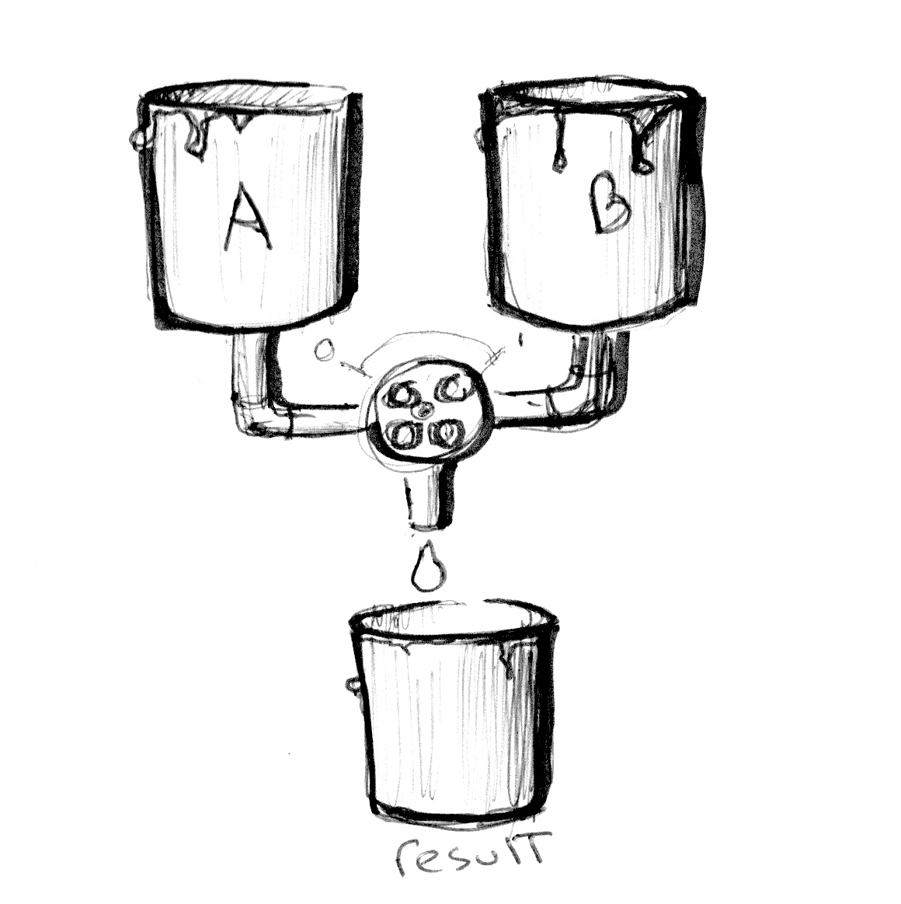

## 色について


GLSLのベクトル型について話す機会がまだあまりありませんでした。先に進む前にこれらの変数についてもっと学んでおくことが大事です。ここで色について考えることはベクトル型をより良く理解するためのとても良い題材になります。

オブジェクト指向のプログラミングに慣れている方であれば、ここまでベクトルの中のデータに、C言語の ```struct``` やその種の構造体と同様の方法でアクセスしてきたことに気づいたでしょう。

```glsl
vec3 red = vec3(1.0,0.0,0.0);
red.x = 1.0;
red.y = 0.0;
red.z = 0.0;
```

色をx, y, zで表して定義するのは分かりにくいし誤解を招きそうですね。そのため、ベクトル型の変数では同じ情報に違う名前を使ってアクセスできるようになっています。```.x``` ```.y``` ```.z``` の代わりに ```.r``` ```.g``` ```.b``` もしくは ```.s``` ```.t``` ```.p``` を使うことができるのです（```.s``` ```.t``` ```.p``` は通常、テクスチャ空間の座標を示すのに使われます。これについては後の章で学びます)。ベクトル型のデータにはまた、 ```[0]``` ```[1]```  ```[2]``` といったインデックスを使ってアクセスすることもできます。

下記のコードでは同じデータにアクセスするための全て方法を示しています。

```glsl
vec4 vector;
vector[0] = vector.r = vector.x = vector.s;
vector[1] = vector.g = vector.y = vector.t;
vector[2] = vector.b = vector.z = vector.p;
vector[3] = vector.a = vector.w = vector.q;
```

ベクトルの中の値を呼び表すためのこれらの方法は、分かりやすいコードを書くために用意された仕組みです。シェーダー言語に備わったこの柔軟性は、色と空間座標を交換可能なものとして考える足がかりになります。

もう1つ、GLSLのベクトル型の素晴らしい機能として、これらの値の名前を好きな順番で組み合わせて使えることが挙げられます。このおかげで簡単に値を入れ替えたり、異なる型へ変換することができます。この機能はswizzleと呼ばれています。


```glsl
vec3 yellow, magenta, green;

// Making Yellow
yellow.rg = vec2(1.0);  // Assigning 1. to red and green channels
yellow[2] = 0.0;        // Assigning 0. to blue channel

// Making Magenta
magenta = yellow.rbg;   // Assign the channels with green and blue swapped

// Making Green
green.rgb = yellow.bgb; // Assign the blue channel of Yellow (0) to red and blue channels
```

#### 便利な道具

数値を使って色を指定するのに慣れていないかもしれません。なかなか直感的ではありませんからね。ありがたいことに、手助けになる良くできたプログラムが数多くあります。あなたの使い道にあったものを見つけて ```vec3``` や ```vec4``` の形式で色を取り出せるように設定しておきましょう。例えば、下記は私が[Spectrum](http://www.eigenlogik.com/spectrum/mac)で使っているテンプレートです。

```
	vec3({{rn}},{{gn}},{{bn}})
	vec4({{rn}},{{gn}},{{bn}},1.0)
```

### 色の調合

色がどのように定義されるか分かったところで、これまでに学んだ知識と組み合わせてみましょう。GLSLにはとても便利な [```mix()```](../glossary/?search=mix) 関数があり、2つの値をパーセンテージを指定して混ぜ合わせることができます。
パーセンテージの範囲はわかりますか？ そう、0.0 から 1.0 ですね。長い時間をかけてミヤギさんの壁でカラテの修行を積んだあなたにはピッタリです。さあ学んだ技を披露しましょう。



下記のコードの18行目で、サイン波の値の絶対値が ```colorA``` と ```colorB``` を混ぜ合わせるために使われている様子を見てください。

<div class="codeAndCanvas" data="mix.frag"></div>

さあ、あなたの技を披露する番です。

* 色を表情豊かに変化させてください。なにか特定の感情を思い浮かべてみましょう。一番ふさわしいのは何色ですか? どのように現れてどのように消えていくのでしょう? もう1つ別の感情について考えて、ふさわしい色を選んでください。上記のサンプルの始まりと終わりの色をこの2つの感情の色に変えてください。次にシェイピング関数を使って色を滑らかに変化させましょう。

Robert Pennerは[イージング関数](http://easings.net/)と呼ばれる、コンピューターアニメーションでよく使われる一連の関数を開発しました。[このサンプル](../edit.html#06/easing.frag)を使って研究したりインスピレーションを得ることもできますが、一番良いのはあなた自身で関数を作ってみることでしょう。

### グラデーションで遊ぶ

[```mix()```](../glossary/?search=mix)関数には幅広い使い道があります。3つ目の引数として単に ```float``` で割合を指定する代わりに、最初の2つの引数に対応する型の値を渡すことができます。上記のサンプルでは ```vec3``` を使いました。こうすることで ```r```, ```g```,  ```b``` のそれぞれのチャンネルを個別のパーセンテージで混ぜ合わせることができます。


下記のサンプルを見てください。前章のサンプルと同じように、色の変化を正規化されたxの値に対応させて線で示しています。今のところ全ての色のチャンネルはこの同じ線に対応しています。

25行目のコメントを外してどうなるか見てみましょう。26行目と27行目のコメントも外してみてください。

<div class="codeAndCanvas" data="gradient.frag"></div>

おそらく、25〜27行目で3つの異なるシェイピング関数が使われていることに気づいたでしょう。これらの関数を書き換えて遊んでみましょう。色々と実験をして面白いグラデーションを作り、前章で学んだ技を披露するチャンスです。下記を試してみましょう。


* ウィリアム・ターナーの夕日のようなグラデーションを作り出してみましょう。

* ```u_time``` を使って日の出から日の入りまでの変化のアニメーションを作ってみましょう。

* 今までに学んだことを使って虹を作り出すことはできますか?

* ```step()``` 関数を使ってカラフルな旗を作ってください。

### HSB

色空間を抜きにして色のことを語ることはできません。おそらくご存知の通り、赤、緑、青のチャンネルで表す以外にも色を体系化する方法があります。

[HSB](http://en.wikipedia.org/wiki/HSL_and_HSV)は色相（Hue）、彩度（Saturation）、明度（Brightness または Value）の頭文字を取ったもので、より直感的で便利な色の体系です。```rgb2hsv()``` と ```hsv2rgb()``` の2つの関数をよく読んでみてください。

x軸を色相、y軸を明度に割り当てると色のスペクトルを作ることができます。HSBの空間的な色の配置は非常に便利で、HSBを使うと、RGBよりも直感的に色を選ぶことができます。

<div class="codeAndCanvas" data="hsb.frag"></div>

### HSBと極座標

HSBはもともとデカルト座標（xとy）ではなく、極座標（中心からの角度と距離）で色を示す仕組みです。私たちのHSB関数を極座標に対応させるには、ピクセル座標を元に、描画領域の中心からの角度と距離を求めなくてはなりません。そのためには [```length()```](../glossary/?search=length)関数と [```atan(y,x)```](../glossary/?search=atan)関数を使います。  ```atan(y,x)``` は一般的な言語で使われている ```atan2(y,x)``` のGLSL版です。

ベクトルや三角関数を扱う際には ```vec2```, ```vec3``` や ```vec4``` を、それらが色を表している場合でもベクトルと見なします。私たちは色とベクトルを同等に扱います。そして、このフレキシブルな考え方が様々なことを実現する支えになるのを目の当たりにするでしょう。

もし興味があれば、 [```length```](../glossary/?search=length) の他にも沢山の幾何学関数があります。

- [```distance()```](../glossary/?search=distance)
- [```dot()```](../glossary/?search=dot)
- [```cross```](../glossary/?search=cross)
- [```normalize()```](../glossary/?search=normalize)
- [```faceforward()```](../glossary/?search=fraceforward)
- [```reflect()```](../glossary/?search=reflect)
- [```refract()```](../glossary/?search=refract)

また、GLSLにはベクトル型の値を比較するための特別な関数があります。

- [```lessThan()```](../glossary/?search=lessThan)
- [```lessThanEqual()```](../glossary/?search=lessThanEqual)
- [```greaterThan()```](../glossary/?search=greaterThan)
- [```greaterThanEqual()```](../glossary/?search=greaterThanEqual)
- [```equal()```](../glossary/?search=equal)
- [```notEqual()```](../glossary/?search=notEqual).

角度と距離を求めたら、それを正規化して 0.0 から 1.0 の間に収める必要があります。下のサンプルの27行目の [```atan(y,x)```](../glossary/?search=atan) は角度を -π から π（-3.14...から3.14...）の間の値で返すので、これをコードの冒頭で定義されている ```TWO_PI``` で割って -0.5 から 0.5 の値にします。そして単純に 0.5 を足せば望み通りの 0.0 から 1.0 の値が手に入ります。描画領域の中心から距離を測っているので、半径は最大で 0.5 になります。最大値を 1.0 にするためにはこの幅を倍にする（2を掛ける）必要があります。

このように、値の範囲を変換して 0.0 から 1.0 の扱いやすい値にすることが大事です。

（訳注：この半径についての説明は正確ではありません。例えば描画領域の中心から角までの距離を2倍にするとルート2になるので1.0を超えてしまいます。必ず値が0.0から1.0に収まるようにするにはどうすればいいか、また ```hsb2rgb``` 関数に想定外の大きな値や小さな値を渡すとどうなるか考えて試してみましょう。）

<div class="codeAndCanvas" data="hsb-colorwheel.frag"></div>

下記の課題に挑戦してみましょう。

* 上の極座標のサンプルをMacOSのレインボーカーソルのような、回転する色の輪に変えてください。

* シェイピング関数と、HSBをRGBへ変換する関数とを組み合わせて、特定の色相を広げてその他の色相が狭くなるようにしてください。


* 下の画像を見てください。カラーピッカーで使われている色の輪をよく見ると、サンプルコードとは違う[RYB色空間](https://en.wikipedia.org/wiki/RYB_color_model)に基づく色のスペクトルが使われていることに気づくでしょう（訳注：もちろんこれはアプリケーション次第です。必ずこうなっているとは限りません）。例えば赤の反対は緑のはずですが、サンプルコードではシアンになっています。これを修正して下の画像とまったく同じに見えるようにする方法を考えられるでしょうか（ヒント：シェイピング関数を使うチャンスです）。


#### 関数と引数についての注釈

次の章に進む前にちょっと立ち止まって振り返ってみましょう。引数の型の前にある ```in``` に気づいたでしょう。これは[修飾子（qualifier）](http://www.shaderific.com/glsl-qualifiers/#inputqualifier) と呼ばれるもので、この場合は引数が読み取り専用であることを示しています。この後の章では引数を ```out``` （書き出し専用） や ```inout``` （読み書き両方可能） に指定する例も出てきます。最後の ```inout``` は参照を引数として渡すのと概念的に同じで、渡された変数を変更するようにしてくれます。（訳注：関数の中で変数の値を変更すると、関数に引数として渡した元々の変数の値にも反映されます。）

```glsl
int newFunction(in vec4 aVec4,   // read-only
                out vec3 aVec3,    // write-only
                inout int aInt);   // read-write
```

今はまだ信じられないかもしれませんが、もう私たちはクールな絵を描くために必要な全てを手に入れました。次の章では全ての技を組み合わせて幾何学的な図形を描く方法を学びます。
