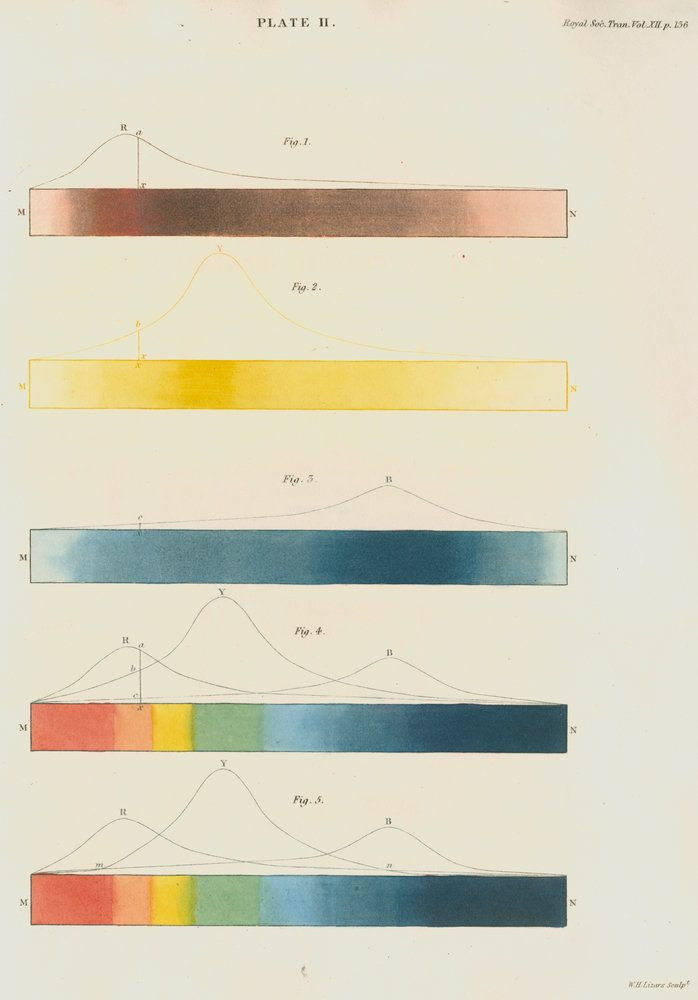
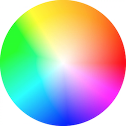

## Color


We didn’t talk much about GLSL vectors. Before going further is important to learn more about these variable types that you will use to store colors. 

If you are familiar with object oriented programming paradigms you had notice that we have been accessing the data inside the vectors like any regular C ```struct```.

```glsl
vec3 red = vec3(1.0,0.0,0.0);
red.x = 1.0;
red.y = 0.0;
red.z = 0.0; 
```

There are other ways to access the same information, which for colors will make your code more readable. The values on ```.x```, ```.y``` and ```.z``` are overloaded to ```.r```, ```.g``` and ```.b```. Also there is an extra nomenclature you can use: ```.s```, ```.t``` and ```.p```. This don’t affect the values and is completely interchangeable. Use it on your own convenience to write clear code.

On ```vec4``` there is an extra value for the alpha that also have different ways to access to it. Also, because vectors are essentially arrays of value you can access to the data just by using the index position of the component you want to modify or set.

That gives a big spectrum of ways to access the same information. All the following calls per line are homologous.

```glsl
vec4 vector;
vector[0] = vector.r = vector.x = vector.s;
vector[1] = vector.g = vector.y = vector.t;
vector[2] = vector.b = vector.z = vector.p;
vector[3] = vector.a = vector.w = vector.q;
```

Another great feature of vectors on GLSL is that this properties can be call combined and in different orders, making easy for example to cast and mix values.

```glsl
vec3 yellow, magenta, blue;

yellow.rg = vec2(1.0);
yellow[2] = 0.0; 

magenta = yellow.rbg;
blue.b = magenta.z;
```

#### For your toolbox

If you have a background on design or new media, you are probably used to picking colors with number, which could be very counterintuitive. Lucky you, there are a lot of smart programs that make this job easy. Research for one that fits your needs and then train it to delivery colors in ```vec3``` or ```vec4``` format. For example here are the templates I use on [Spectrum](http://www.eigenlogik.com/spectrum/mac):

```
	vec3({{rn}},{{gn}},{{bn}})
	vec4({{rn}},{{gn}},{{bn}},1.0)
```

### Mixing color

Now that we know how colors could be define is time to integrate this with our previus knowladege. There is a little happy function that let you mix two values a percentage, it's name is ```mix()```. Can you imagen what's the percentage range? Yes, between 0.0 and 1.0! Which is perfect, because you now have all this knowlage about shaping functions. Our time working on the fense is paying off.

Check the following code at line 18 and see how we are using the absolute values of a sin wave over time to mix ```colorA``` and ```colorB```. 

<div class="codeAndCanvas" data="mix.frag"></div>

Mix can be use with any of the types we have seen so far: ```float```, ```vec2```, ```vec3``` and ```vec4```.

### Playing with gradients 

The ```mix``` function have more to offer. If in the third argument we pass a ```vec3``` instead of a single ```float``` we will be hable to control the transition bettween colors by individual channel.

Take a look to the following example.

<div class="codeAndCanvas" data="gradient.frag"></div>

Similarly to the examples on the previus chapter we are hooking the transition to the normalized *x* coordinate and visualizing it with a line. You can see how all channels goes a long together. 

Now, uncoment line number 25 and see what happens. Then try the lines 26 and 27. Remember that the lines visualize the amount ```colorA``` and ```colorB``` to mix per channel.

You probably recognice the three shaping functions we are using in lines 25 to 27. Play with them! Is time for you to explore and show of your skills learned on the previus chapter and make interesting gradient. Try the following excersices:


* Compose a gradient that resemblance a William Turner sunset

* Animate a transition between a sunrise and sunset using ```u_time```.

* Can you make a rainbow just using what we have learn until now?

* Using ```step()``` function create a procedural flag.

### HSB

Is hard to bring the subject of color with out speaking about color space. As you probably know there are different ways to organize color beside by red, green and blue channel. 

[HSB](http://en.wikipedia.org/wiki/HSL_and_HSV) stands for Hue, Saturation and Brightness (or Value) and is a more intuitive and useful organization of colors. Take a moment to read the ```rgb2hsv()``` and ```hsv2rgb()``` functions on the following code. 

<div class="codeAndCanvas" data="hsv.frag"></div>

Similarly to last mix example this functions plays with the interpolation of the diferent chapters to map it acording to hue.

By mapping the position on the x axis to the Hue and the brightness to the length we can obtain that nice spectrum of visible colors. This spacial distribution of color can be very handy becase, une more time, share the range between 0.0 to 1.0.

This HSB is particularly intuitive for understanding color composition, while give as extraordinary control of our values. Reason why is the default choose for color pickers user interface. 

### HSB in polar coordinates

HSB was originally designed to be represented on polar coordinates (based on the angle and radius) instead of cartesian coordinates (based on x and y). To map our HSB function to polar coordinates we need to obtain the angle and distance from the center of the viewport to the fragment coordinate. For that we will use the ```atan(y,x)``` (which is the GLSL version of ```atan2(y,x)```) and the ```length()``` function.  

Using vectorial and trigonometrical functions, could sound wierd in this content but ```vec2```, ```vec3``` and ```vec4``` are nothing but vectors. We will start treat colors and vectors similarly, in fact you will find very enpowering this conceptual flexibility couldbe. 

If you where wondering, there are more geometric functions beside [```length```](http://www.shaderific.com/glsl-functions/#length) like: [```distance()```](http://www.shaderific.com/glsl-functions/#distance), [```dot()```](http://www.shaderific.com/glsl-functions/#dotproduct), [```cross```](http://www.shaderific.com/glsl-functions/#crossproduct), [```normalize()```](http://www.shaderific.com/glsl-functions/#normalize), [```faceforward()```](http://www.shaderific.com/glsl-functions/#faceforward), [```reflect()```](http://www.shaderific.com/glsl-functions/#reflect) and [```refract()```](http://www.shaderific.com/glsl-functions/#refract). Also GLSL have special vector relational functions such as: [```lessThan()```](http://www.shaderific.com/glsl-functions/#lessthancomparison), [```lessThanEqual()```](http://www.shaderific.com/glsl-functions/#lessthanorequalcomparison), [```greaterThan()```](http://www.shaderific.com/glsl-functions/#greaterthancomparison) and [```greaterThanEqual()```](http://www.shaderific.com/glsl-functions/#greaterthanorequalcomparison).

Once we obtain the angle and the length we need to “normalize” their values to the docile range between 0.0 to 1.0 we are used to. On line 42, ```atan(x,y)``` will return an angle in radians between -PI and PI (-3.14 to 3.14), so we need to divide this number by ```TWO_PI``` (defined on the top of the code) to get values between -0.5 to 0.5 which by a simple addition we can accommodate to the desired range of 0.0 to 1.0. The radius in other hand will return a maximum of 0.5 (because we are calculatin the distance form the center of the viewport) so we need to extend this range to it double (by multiplying by two) to get a maximum of 1.0.

<div class="codeAndCanvas" data="hsv-colorwheel.frag"></div>

As you can see, our game here is all about transforming and mapping ranges to what we want.

By this time will not be a problem to try the following excersises

* Modify the polar example to get a spinning color wheel, just like the waiting mouse icon.

* Use a shaping function together with the conversion function from HSB to RGB to expand a particular hue value and shrink the rest.




* If you look closely to the color wheel used on color pickers (see the image below) use a different spectrum acording to RYB color space. For example, the oposite color of red should be green (which is his opposite), but in our example is cyan. Can you find the way to fix that in order to look exactly like the following image? 



#### Note about functions and arguments

Let’s stop and go back to look deeply to the functions, we will see that both of them receive and returns ```vec3``` variables. Also we will notice the arguments are define as ```in```. This is call variable [qualifier](http://www.shaderific.com/glsl-qualifiers/#inputqualifier) and in this case specify this variable as read only. In future examples we will see that also possible to define them variables as ```out``` or ```inout```. 

```glsl
int newFunction(in vec4 aVec4,   // read-only 
                out vec3 aVec3,    // write-only
                inout int aInt);   // read-write
``` 

You may not belive it, but now we have all the elements to make cool drawings. On the next chapter we will learn how to use all the tricks we have learn to makes geometric forms by *blending* the space. Yep... *blending* the space.


