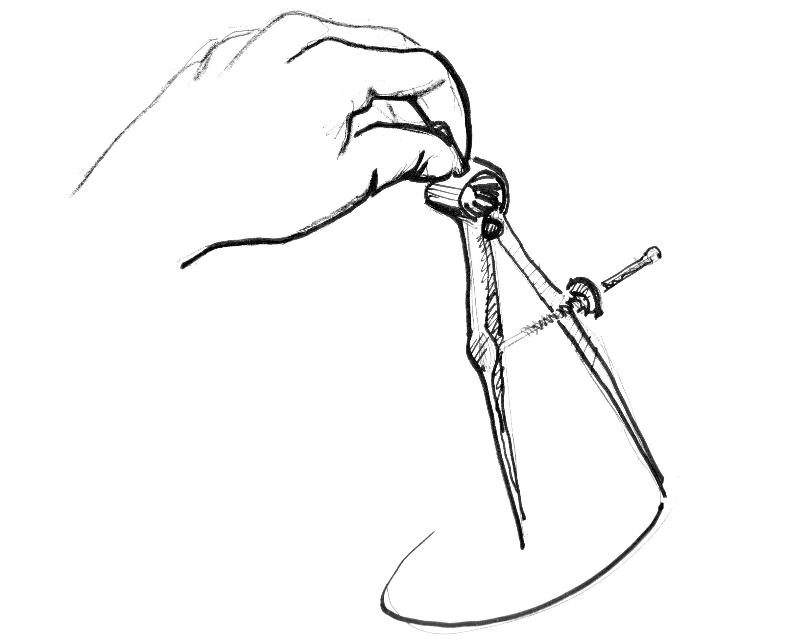
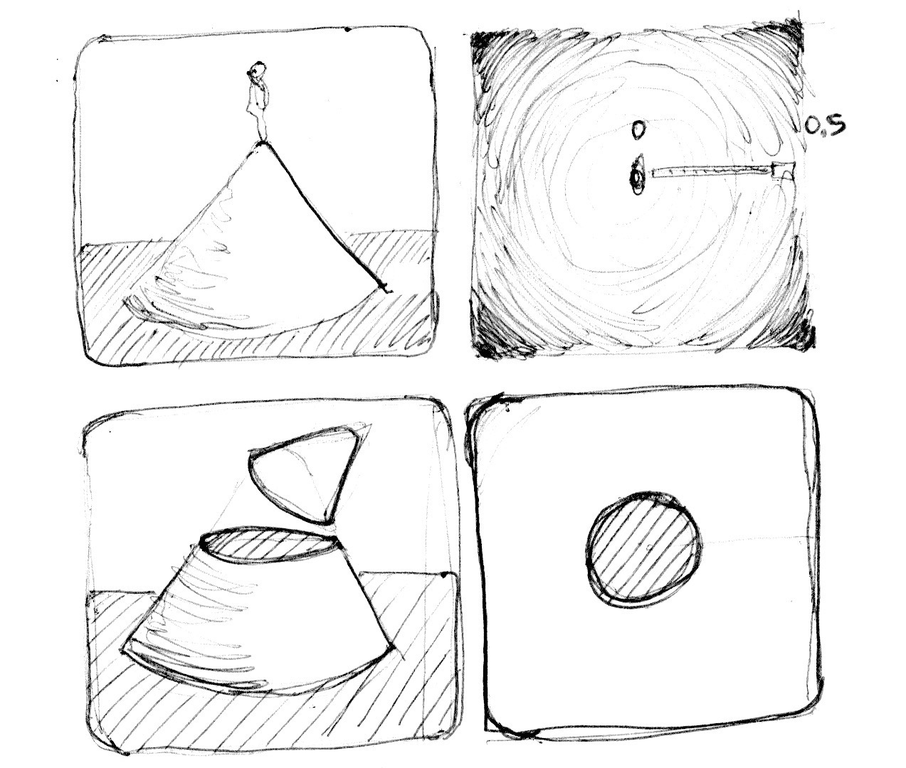

## Shapes


Finally! We have been building skill for this moment! You learn most of the GLSL foundations. You know about types and functions. You practice your shaping equations over and over. Now is time to put all that together. You are up for this challenge. In this chapter we are going to finally learn how to draw simple shapes in a parallel procedural way. 

### Rectangle

Imagine we have a grid paper, like the one we used on math classes, and the homework is to draw a square. The paper size is 10x10 and the square suppose to be 8x8. What you will do?


You paint everything except the last and first rows and last and first column. Right? But now you are probably asking your self what this have to do with shaders? Each little scare of our grid paper is a thread. Each little scare knows their position, like the coordinates of a chess board. In previous chapters he have mapped *x* and *y* to the *red* and *green* color channels, we learn that’s our field and space. A narrow two dimensional territory between 0.0 and 1.0. How we can use it to draw a centered square in the middle of our billboard?

* Sketch a peace of code that use ```if``` statements over our spacial field.

Well done! This is a great step and accomplish. And speaking about steps, how we can simplify this code that use ```if``` statements with ```step()``` functions? Take a look to the following code.

```glsl
#ifdef GL_ES
precision mediump float;
#endif

uniform vec2 u_resolution;
uniform float u_time;

void main(){
    vec2 st = gl_FragCoord.xy/u_resolution.xy;
    vec3 color = vec3(0.0);
    
    float left = step(0.1,st.x);
    float bottom = step(0.1,st.y);
    
    color = vec3( left * bottom );

    gl_FragColor = vec4(color,1.0);
}
```

Here we are using ```step()``` to turn everything bellow 0.1 to to 0.0 (black). That will make a line on the left and bottom of the canvas.


If we look close, on the previous code we repeat the structure for each side axis for left and bottom. We can save some lines of code by passing directly two values and treating them in the same way with the same function. Check the following code.

<div class="codeAndCanvas" data="rect-making.frag"></div>

But this rectangle is not centered, is in the top right corner. We need to “take out” equal peaces on both extremes on left-bottom and tight-top to obtain a centered square.

So, to repeat this on the top-right side we can invert the ```st``` gradient and repeat the same ```step()``` function. That way the ```vec2(0.0,0.0)``` will be on the top right corner. This is the digital equivalent of flipping the page. 


Interesting right? Because we only know the coordinate position per pixel, our drawing methods are based on it. Drawing shapes is all about flipping and stretching this coordinate system.

Before the going forward, let’s use the simplicity of the rectangle as a training case. Try the following challenges:

* Can you simplify lines between 16 and 21 in a two single lines? What about one line?

* Experiment with the same code but using ```smoothstep()``` instead of ```step()```. Note that by changing values, you can go from blurred edges to elegant antialiased borders.

* Do another implementation that use ```floor()```.

* How you can draw rectangles of different sizes instead of just squares.

* Choose the implementation you like the most and make a function of it that you can reuse in the future. Leave it flexible and efficient.

* Make another function that just draw the outline of a rectangle.

* How do you think we can move and place different rectangles in a  same billboard? If you figurate out how, show of your skills making a composition of rectangles and colors that resemble a [Piet Mondrian](http://en.wikipedia.org/wiki/Piet_Mondrian) painting.


### Circles

In the same way is easy to draw squares on grid paper, is relatively easy to draw rectangles with cartesians coordinates. But circles requires another approach. Some how we need to *treat* the spacial coordinates in a way that at the end we can draw circles with just a ```step()``` functions. 

Going back to the grid paper and the math class,  we were hable to draw perfect circles by opening a compass by the desired radius, pressing one of the endings on the desired center of the circles and spinning the other end around.



If we do this over a grid paper, thinking that each square on the grid is a pixel, we can draw a circle by *asking* each pixel (or thread) if they are inside the area of the circle. Right? We can know that area by computing the distance to the center of the center of the circle.


There are several ways to calculate that. The easiest one is just using the ```distance()``` functions, which internally computes the ```length()``` of the difference between two points (in our case the fragment coordinate and the center of the canvas). The ```length()``` function is nothing but a shortcut of the [hypotenuse equation](http://en.wikipedia.org/wiki/Hypotenuse) that use square root (```sqrt()```) internally.


So far I just describe three functions (```distance()```, ```length()``` and ```sqrt()```) you can use. The following code  contain this three functions and how to get the exactly same result with each one. Note that on it we are mapping the distance to the center of the billboard to the color brightness of the pixel.

<div class="codeAndCanvas" data="circle-making.frag"></div>

* Comment and uncomment lines to try the different ways to get the same result.

The resultan *mapping* values between distance and brightness can be a really helpful technique. Note that, the closer the pixel is to the center the lower (darker) values it have. Values don't get to high because from the center ( ```vec2(0.5, 0.5)``` ) the maximum distance barely goes over 0.5. Contemplate this map and think:

* What you can infer from it? 

* How we can use this to draw a circle?

* Modify the above code in order to contain the circular gradient inside the canvas.

### Distance field

Imagine the above example as an inverse altitude map. The darker the taller. The gradient show us the pattern of something shape similar to a cone view from above. Imagine your self on the top of that cone, under your foot you hold the tip of a ruled tape while the rest of it goes than the hill. Because you are in the center of the canvas, the ruler will mark "0.5" in the extreme. This will be constant in all your directions. Buy choosing where to cut horizontally the top of cone you will get a bigger or smaller circular surface.



Interesting right? We can combine this re-interpretation of space to make shapes based on the distance to 0. This technique is known as “distant field” and is use in different ways from font outlines to 3D graphics.

Try the following excursuses:
 
* Use ```set()``` to turn everything above 0.5 to white and everything bellow to 0.0

* Inverse the colors of the background and foreground.

* Using ```smoothstep()``` experiment trying different values to get nice antialiased borders on your circle.

* Once you are happy with an implementation make a function of it that you can reuse in the future. 

* Use your function to mask a color with it.

* Can you animate your circle to grow and shrink simulating a beating heart?

* What about moving this circle? Can you move an place different circles in a single billboard?

* What happen if you combine distances fields together using different functions and operations.

```glsl
pct = distance(st,vec2(0.4)) + distance(st,vec2(0.6));
pct = distance(st,vec2(0.4)) * distance(st,vec2(0.6));
pct = min(distance(st,vec2(0.4)),distance(st,vec2(0.6)));
pct = max(distance(st,vec2(0.4)),distance(st,vec2(0.6)));
pct = pow(distance(st,vec2(0.4)),distance(st,vec2(0.6)));
```

* Make three compositions using this technique. If they are animated better!

#### For your tool box

In terms of computational power ```sqrt()``` function (and all the once that depend on it) can be expensive. Here is another way to create a circular distance field by using ```dot()``` product.

<div class="codeAndCanvas" data="circle.frag"></div>

### More about shapes and distance fields

Distance fields can be use to draw almost everything. Obviously the complex the shape is, the more complicated the equation will be, but it pays off; a convenient feature of this technique is the ability to smooth edges. Because the “topological” nature of them, sharp edges get blended together producing softer edges the more away you are from the center you sample. This is particularly useful on fonts rendering.

Take a look to the following code and note how the space is mapped. Like concentric rings on a Zen garde the distance field values on edges get smooth and rounder the further away they get from the center.

<div class="codeAndCanvas" data="triangle-making.frag"></div>

If you play with the code you will discover that inside the triangle there is a negative area. Which in position makes shapes extremely sharp to the extreme. Because the values are under zero we can not see the difference but by changing ```fract()``` by ```sin()``` in line 43 you can see the triangle go shrink until disappear. This signed properties particular of **Signed Distance Fields**.

### Polar shapes


In the chapter about color we map the cartesian coordinates to polar coordinates by calculating the *radius* and *angles* of each pixel with the following formula:

```glsl
    vec2 pos = vec2(0.5)-st;
    float r = length(pos)*2.0;
    float a = atan(pos.y,pos.x);
```

In the previous examples we have use the radius (from the center) to draw a circles. Now, if we compute the angle from the pixel (threat) to the center, we can modulate the radius to achieve different shapes. How? Yes! Shaping functions!

Below you will find the same functions in the cartesian graph and in a polar coordinates shader example (between lines 21 and 26). Uncomment one by one the functions paying attention the relationship between one coordinate system and the other

<div class="simpleFunction" data="y = cos(x*3.);
//y = abs(cos(x*3.));
//y = abs(cos(x*2.5))*0.5+0.3;
//y = abs(cos(x*12.)*sin(x*3.))*.8+.1;
//y = smoothstep(-.5,1., cos(x*10.))*0.2+0.5;"></div>

<div class="codeAndCanvas" data="polar.frag"></div>

Try to:

* Animate this shapes
* Combine different shaping functions to *cut holes* on the shape to make better flowers, snowflakes and gears.
* Use the ```plot()``` function we were using on the *Shaping Functions Chapter* to draw just the contour.

Congratulations! You have made it through the rough part! Take a break and let this concepts sediment, drawing simple shapes on Processing is really easy but not here. In shader-land everything the way to thing on shapes is twisted and can be exhausting to adapt to this new paradigm of coding. 

Now that you know how to draw shapes I'm sure new ideas will pop to your mind. In the following chapter we will learn more about how to move, rotate and scale them moving. This will allow you to compose them!
