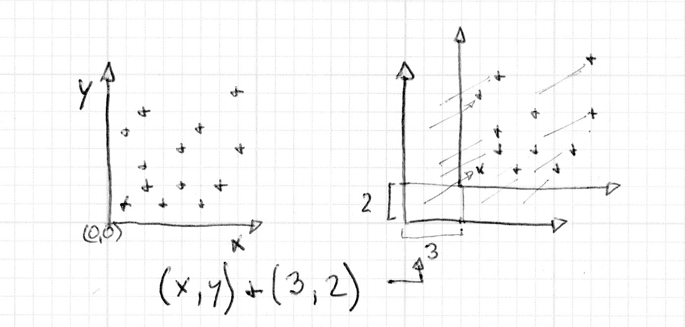
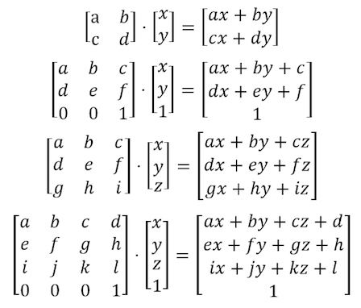

## 2D Matrices
## 二次元行列

<canvas id="custom" class="canvas" data-fragment-url="matrix.frag"  width="700px" height="200px"></canvas>

### Translate
### 平行移動

In the previous chapter we learned how to make some shapes - the trick to moving those shapes is to move the coordinate system itself. We can achieve that by simply adding a vector to the ```st``` variable that contains the location of each fragment. This causes the whole space coordinate system to move.

前の章では図形を描く方法を学びました。この章では描いた図形を動かしてみましょう。秘訣は座標系自体を動かしてしまうことです。これはそれぞれのフラグメント（ピクセル）の位置を格納する変数 ```st``` にベクトルを加えれば簡単に実現することができます。



This is easier to see than to explain, so to see for yourself:

説明するよりも実際に見た方が簡単です。自分自身で試してみましょう。

* Uncomment line 35 of the code below to see how the space itself moves around.

* 下記のコードの35行目のコメントを外して、空間全体が動いている様子を見てみましょう。

<div class="codeAndCanvas" data="cross-translate.frag"></div>

Now try the following exercise:

下記の課題に挑戦してみましょう。

* Using ```u_time``` together with the shaping functions move the small cross around in an interesting way. Search for a specific quality of motion you are interested in and try to make the cross move in the same way. Recording something from the "real world" first might be useful - it could be the coming and going of waves, a pendulum movement, a bouncing ball, a car accelerating, a bicycle stopping.

* ```u_time``` とシェイピング関数を使って、小さな十字に面白い動きをさせてください。なにか気になる動き方の例を探して、同じように十字を動かしてみましょう。寄せて返す波や、振り子、弾むボール、加速する自動車、自転車が止まるところなど、まずは現実世界のできごとを記録してみるのも良いかもしれません。

### Rotations

### 回転

To rotate objects we also need to move the entire space system. For that we are going to use a [matrix](http://en.wikipedia.org/wiki/Matrix_%28mathematics%29). A matrix is an organized set of numbers in columns and rows. Vectors are multiplied by matrices following a precise set of rules in order to modify the values of the vector in a particular way.

物体を回転させるにはやはり空間全体を動かす必要があります。そのためには[行列（matrix）](https://ja.wikipedia.org/wiki/%E8%A1%8C%E5%88%97)を使います。行列とは行（横方向）と列（縦方向）に並べられた数字の集まりです。決められたルールに従ってベクトルに行列を掛け合わせることで、ベクトルの値をある法則に沿って変化させることができます。


[](https://ja.wikipedia.org/wiki/%E8%A1%8C%E5%88%97)

GLSL has native support for two, three and four dimensional matrices: [```mat2```](../glossary/?search=mat2) (2x2), [```mat3```](../glossary/?search=mat3) (3x3) and [```mat4```](../glossary/?search=mat4) (4x4). GLSL also supports matrix multiplication  (```*```) and a matrix specific function ([```matrixCompMult()```](../glossary/?search=matrixCompMult)).

GLSLはネイティブで二次元、三次元、四次元の行列をサポートしています。[```mat2```](../glossary/?search=mat2)（2×2）、[```mat3```](../glossary/?search=mat3) （3×3）、[```mat4```](../glossary/?search=mat4) （4×4）がそれぞれ対応します。GLSLはまた行列の掛け算（```*```）
や行列に特化した関数（[```matrixCompMult()```](../glossary/?search=matrixCompMult)）もサポートします.


Based on how matrices behave it's possible to construct matrices to produce specific behaviors. For example we can use a matrix to translate a vector:

行列の性質をうまく使うと、特定の作用を生み出すことができます。例えば行列を使ってベクトルを平行移動させることができます。


More interestingly, we can use a matrix to rotate the coordinate system:

さらに興味深いことに、行列は座標系を回転させるためにも使うことができます。


Take a look at the following code for a function that constructs a 2D rotation matrix. This function follows the above [formula](http://en.wikipedia.org/wiki/Rotation_matrix) for two dimentional vectors to rotate the coordinates around the ```vec2(0.0)``` point.

二次元の回転行列を作り出す下記のコードを見てみましょう。この関数は二次元ベクトルについての上記の[公式](https://ja.wikipedia.org/wiki/%E5%9B%9E%E8%BB%A2%E8%A1%8C%E5%88%97)に従って ```vec2(0.0)``` を中心に座標を回転させます。


```glsl
mat2 rotate2d(float _angle){
    return mat2(cos(_angle),-sin(_angle),
                sin(_angle),cos(_angle));
}
```

According to the way we've been drawing shapes, this is not exactly what we want. Our cross shape is drawn in the center of the canvas which corresponds to the position ```vec2(0.5)```. So, before we rotate the space we need to move shape from the `center` to the ```vec2(0.0)``` coordinate, rotate the space, then finally move it back to the original place.

これまでに学んだ描画方法を思い出してみると、この関数は本当に欲しいものとはちょっと違います。私たちの十字は描画領域の中心に相当する（ ```vec2(0.5)``` ）に描かれています。そのため、空間を回転させる前に図形を中心から ```vec2(0.0)``` まで移動させてやる必要があります。移動させたらその場で空間を回転させ、またもとの場所に戻してやります。


That looks like the following code:

コードで示すと下記のようになります。

<div class="codeAndCanvas" data="cross-rotate.frag"></div>

Try the following exercises:

下記の課題に挑戦してみましょう。

* Uncomment line 45 of above code and pay attention to what happens.

* 上記のコードの45行目のコメントを外して何が起きるかに注目してください。

* Comment the translations before and after the rotation, on lines 37 and 39, and observe the consequences.

* 37行目と39行目、回転の前後にある平行移動をコメントアウトして、結果を観察しましょう。

* Use rotations to improve the animation you simulated in the translation exercise.

* 平行移動についての課題で作った作品を、回転を使ってさらに改善してみましょう。

### Scale

### 拡大・縮小

We've seen how matrices are used to translate and rotate objects in space. (Or more precisely to transform the coordinate system to rotate and move the objects.) If you've used 3D modeling software or the push and pop matrix functions in Processing, you will know that matrices can also be used to scale the size of an object.

ここまでは行列を使って物体を空間の中で平行移動させたり回転させたりする様子（より正確には、座標系全体を変形させることで物体を動かしたり回転させる様子）を見てきました。3DモデリングのソフトウェアやProcessingのpushやpopなどの行列関数を使ったことがあれば、行列を使って物体の大きさを拡大・縮小できることもご存知でしょう。


Following the previous formula, we can figure out how to make a 2D scaling matrix:

上記の公式に従えば、二次元の拡大・縮小を行う行列を作ることができます。


```glsl
mat2 scale(vec2 _scale){
    return mat2(_scale.x,0.0,
                0.0,_scale.y);
}
```

<div class="codeAndCanvas" data="cross-scale.frag"></div>

Try the following exercises to understand more deeply how this works.

下記の課題に挑戦して理解を深めましょう。

* Uncomment line 42 of above code to see the space coordinate being scaled.

* 上記のコードの42行目のコメントを外して空間座標が拡大・縮小していることを確認しましょう。

* See what happens when you comment the translations before and after the scaling on lines 37 and 39.

* 37行目と39行目、拡大・縮小の前後にある平行移動をコメントアウトして、結果を見てみましょう。

* Try combining a rotation matrix together with a scale matrix. Be aware that the order matters. Multiply by the matrix first and then multiply the vectors.

* 回転行列と拡大・縮小を行う行列を組み合わせてみましょう。順番が重要なので注意してください。行列同士を掛け合わせてから最後にベクトルを掛けるようにします。

* Now that you know how to draw different shapes, and move, rotate and scale them, it's time to make a nice composition. Design and construct a [fake UI or HUD (heads up display)](https://www.pinterest.com/patriciogonzv/huds/). Use the following ShaderToy example by [Ndel](https://www.shadertoy.com/user/ndel) for inspiration and reference.

* 様々な図形の描き方、回転、拡大・縮小のやり方を身につけたので、今度はそれらを組み合わせてより複雑なものを構成してみましょう。[架空のUIやヘッドマウントディスプレイの画面](https://www.pinterest.com/patriciogonzv/huds/)をデザインして組み立ててみます。[Ndel](https://www.shadertoy.com/user/ndel)が作成したSharderToyのサンプルを参考にしてください。


<iframe width="800" height="450" frameborder="0" src="https://www.shadertoy.com/embed/4s2SRt?gui=true&t=10&paused=true" allowfullscreen></iframe>

### Other uses for matrices: YUV color

### その他の行列の用途： YUVカラー

[YUV](http://en.wikipedia.org/wiki/YUV) is a color space used for analog encoding of photos and videos that takes into account the range of human perception to reduce the bandwidth of chrominance components.

[YUV](https://ja.wikipedia.org/wiki/YUV)は人間の知覚できる範囲を考慮して色成分の帯域を減らすことのできる、写真やビデオのアナログエンコーディングで用いられる色空間です。


The following code is an interesting opportunity to use matrix operations in GLSL to transform colors from one mode to another.

下記のコードは色を1つのモードから別のモードに変換する、GLSLでの行列演算の面白い使い道の例です。

<div class="codeAndCanvas" data="yuv.frag"></div>

As you can see we are treating colors as vectors by multiplying them with matrices. In that way we “move” the values around.

見てのとおり色をベクトルとして扱い行列を掛け合わせています。このようにして色の値を「動かす」ことができるのです。

In this chapter we've learned how to use matrix transformations to move, rotate and scale vectors. These transformations will be essential for making compositions out of the shapes we learned about in the previous chapter. In the next chapter we'll apply all we've learned to make beautiful procedural patterns. You will find that coding repetition and variation can be an exciting practice.

この章では行列を使ってベクトルを移動、回転、拡大・縮小する方法を学びました。これらの変形は、前章で学んだ図形を組み合わせてより複雑な図を作成するのに欠かせない技術です。次の章ではこれまで学んだことを全て活かして、規則に基づいた美しいパターンを作成します。コードによる反復と変奏の楽しさを発見しましょう。

