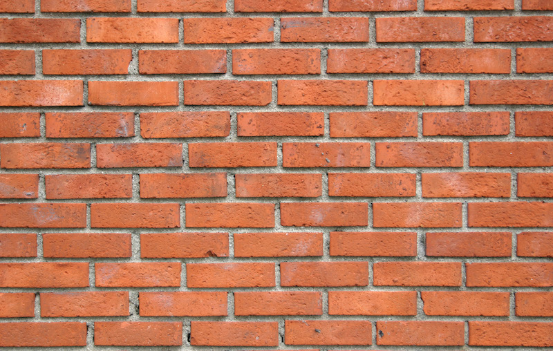
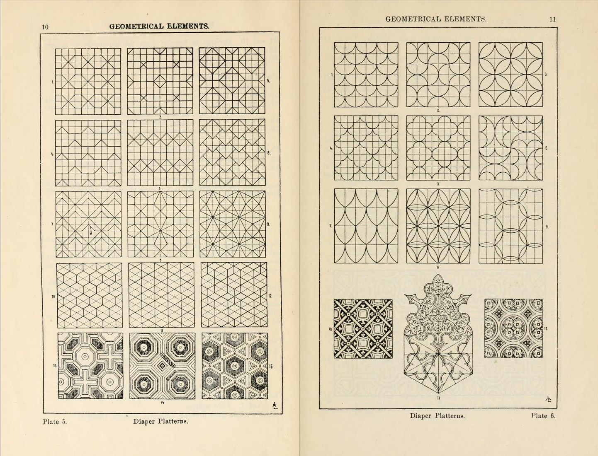

## Patterns

Because in a shader programs are executed by pixel-by-pixel it doesn't really matters how much your repeat a shape. The number of calculations stays constant. That means that fragments shaders can be a particulary suitable tile patterns. 


In the following chapter we are going to apply what we have learn so far an repeat it a long a canvas. Like the previous chapters our strategy is going to be based on multiplying the space coordenates (between 0.0 and 1.0) so the shapes we have been drawing in space between the values 0.0 and 1.0 will be repeated making a grid subscapes. 

*"The grid provide a framwrok withing which human intuition and ivention can operate and that it can subvert. Whitin the chaos of nature patterns provide a constrast and promise of order. From early paterns on pottery to geometric mosaics in Roman baths, people have long used grids to enhace their lives with decoration."* [*10 PRINT*, Mit Press, (2013)](http://10print.org/)

First lets remember the [```fract()```](http://www.shaderific.com/glsl-functions/#fractionalpart) function, which is in esense the modulo of one (```mod(x,1.0)```), because return the fraction part of a number. On other words the number after the floating point. Our normalized coordinate system variable (```st```) already goes from 0.0 to 1.0 so it doesn't make sense to do something like:

```glsl
void main(){
	vec2 st = gl_FragCoord.xy/u_resolution;
	vec3 color = vec3(0.0);
    st = fract(st);
	color = vec3(st,0.0);
	gl_FragColor = vec4(color,1.0);
}
```

But if we scale the normalized coordinate system up, let's say by three we will get three sequence of linear interpolations between 0-1, the first one between 0-1 and the second one for the floating points between 1-2 and the third one for the floating points after 2 and before 3.

<div class="codeAndCanvas" data="grid-making.frag"></div>

Now is time to draw something on each subspace in the same way we did on previus chapters, by uncomenting line 23. Because we are multiplying equally en x and y the aspect ratio of the space doesn't change and shapes on them will be as expected.

Try some of the following excersices to get a deeper

* Try different numbers to multiply the space. Try with floating point values and also with different values for x and y.

* Make a re usable function of this tiling trick.

* Dividing the space on 3 rows and 3 columns find a way to know in which column and row the thread is and use that to change the shape that is displaying. Try to compose a tic-tac-toe match.

### Apply matrixes inside patterns 

Because each subdivision or cell is a smaller version of the normalized coordinate system we have been using before we can apply a matrix transformation to it in order to translate, rotate or scale the space inside. 

<div class="codeAndCanvas" data="checks.frag"></div>

### Offset patterns

So let's say we want to imitate how brick walls looks like. Pay attention to it, is immediately evident the presence of a half bridge offset on x every other row. How we can do that?



As a first step we need to know if the row of our thread is an even or un-even number, because we can use that to determine if we need to offset the x is necessary.

For that we are going to use ```fract()``` again but with the coordinates at the double of space. Take a look to the folowing formula and how it looks like.

<div class="simpleFunction" data="y = fract(x*0.5);"></div>

By multiplying *x* by a half the space coordinate duplicate it size (which is the oposite of what we have been doing where we multiply the ```st``` and the space got shrinked). Let's say we are in position 1.0 (not even) we divide by two will be 0.5, while if the position was 2.0 (even) we devide by two the result will be 1.0. For values over 2.0, ```fract()``` will wrap them up and start again and again. This means the return value of this function will give numbers bellow 0.5 for not even numbers and above 0.5 for even. Isn't this super help full?

Now we can apply some offset to not even rows to give some *brick* effect to our tiles. Check line number 10 and 11 of the following code:

<div class="codeAndCanvas" data="bricks.frag"></div>

## Truchet Tiles

Now that we had learn ways to know if our cell is on even or un even rows and columns is possible to reuse a single design element depending on their position. Conside the case of the [Truchet Tiles](http://en.wikipedia.org/wiki/Truchet_tiles) where a single design element can be presented in four diferent ways:


By changing the patter acros tiles is possible to contruct infinite set of  complex designs. 


Pay close attention to the function ```rotateTilePattern()``` and subdivide the space in four cells and assign one angle of rotation for each one.

<div class="codeAndCanvas" data="truchet.frag"></div>

* Comment, uncomment and duplicate lines 51 to 54 for to compose new designs.

## Making your own rules

Making procedural patterns is a mental excercise for finding minimal an reusable elements. This practice is particulary old, we as a specie have been using grids and patterns to decorate textules, floors and borders of objects since a long time. The pleasure of repetition and variation, have mesmarize our imagination for a long time. Take your time to look [decorative patterns](https://www.pinterest.com/patriciogonzv/paterns/), see how artist and designers have challenge a long the history the fine edge between  predictibility of order and the surprise of variation and chaos. From arabic geometrical patterns, to gorgeus japanise designs, there is an entire universe of patterns to learn from. 

