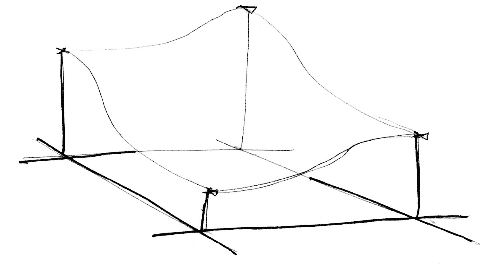
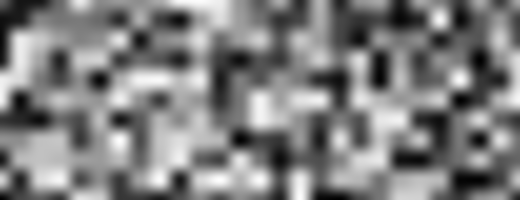
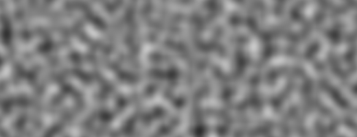
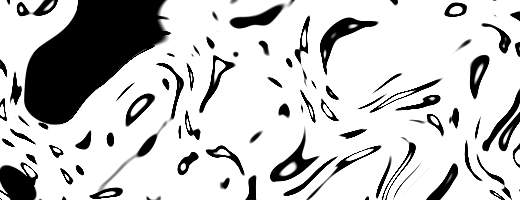
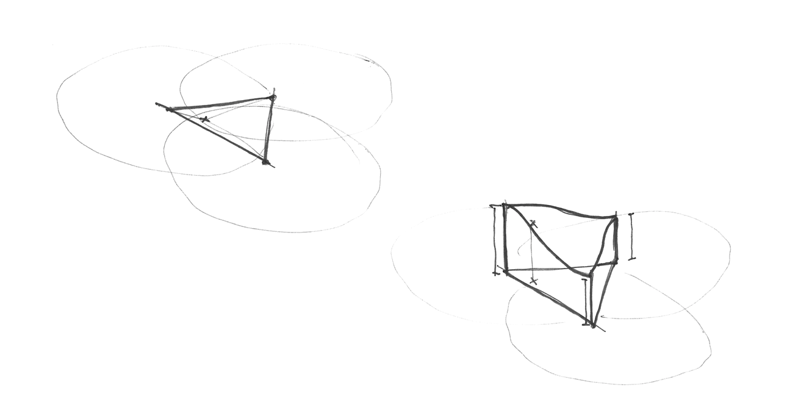
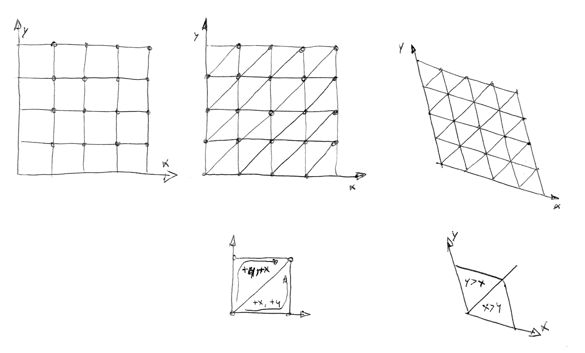
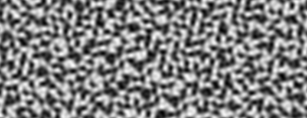

## Bruit

Il est temps de faire une pause!
Nous avons joué avec des fonctions aléatoires qui ressemblait au bruit blanc d'une télévision.
On a encore la tête qui tourne en pensant aux shaders et nos yeux sont fatigués.
Il est grand temps de sortir faire un tour!

Nous sentons l'air sur notre peau, le soleil dans les yeux, le monde est tellement vibrant et coloré.
Les couleurs, les textures, les sons. Pendant notre balade, nous ne pouvons nous empêcher de remarquer la surface de la route, les rochers, les arbres et les nuages.


Le côté imprévisible des variations de ces textures pourrait s'apparenter à de l'aléatoire mais elles semblent loin des fonctions aléatoires que nous avons vues juste avant.
Le monde est tellement complexe, comment pouvons nous programmer un shader pour nous rapprocher de cette immense variété?

Cette question fut posée à [Ken Perlin](https://mrl.nyu.edu/~perlin/) en 1980 quand il fut missionné pour trouver un moyen de générer des textures plus réalistes pour le film "Tron".
Le résultat de ses recherches fut un élégant algorithme de *bruit* qui fut récompensé par un Oscar (rien que ça).


Ce qui suit n'est pas l'algorithme de Perlin mais il donne les clés pour comprendre comment générer du *bruit* à partir de valeurs aléatoires.

<div class="simpleFunction" data="
float i = floor(x);  // integer
float f = fract(x);  // fraction
y = rand(i); //rand() is described in the previous chapter
//y = mix(rand(i), rand(i + 1.0), f);
//y = mix(rand(i), rand(i + 1.0), smoothstep(0.,1.,f));
"></div>

Nous commençons par quelque chose d'assez proche de ce que nous avons fait au chapitre précédent.
Nous récupérons les parties entières (```i```) et fractionnelles (```f```) de ```x```.
Nous utilisons [```floor()```](.../glossary/?search=floor) pour obtenir ```i``` et [```fract()```](.../glossary/?search=fract) pour obtenir ```f```.
Ensuite nous appelons ```rand()``` sur la partie entière de ```x```, ce qui renvoie une valeur unique par entier.

Après quoi, vous voyez deux lignes commentées, la première fait une interpolation linéaire entre les deux valeurs ```rand( i )``` et ```rand( i+1 )```

```glsl
y = mix(rand(i), rand(i + 1.0), f);
``` 

Décommentez cette ligne pour voir ce que ça donne.
Nous utilisons la partie fractionnelle `f` pour mélanger ([```mix()```](.../glossary/?search=mix)) les deux valeurs aléatoires.

Nous savons qu'il existe différentes manières d'interpoler des valeurs entre 0 et 1.
Décommentez la ligne suivante qui utilise un [```smoothstep()```](.../glossary/?search=smoothstep) pour calculer l'interpolation au lieu de l'interpolation linéaire.

```glsl
y = mix(rand(i), rand(i + 1.0), smoothstep(0.,1.,f));
```

Vous devriez constater que la transition entre pics est beaucoup plus souple.
Dans certaines implémentations, vous verrez que les programmeurs préfèrent parfois coder leur propre fonction cubique (comme la formule suivante) au lieu d'utiliser [```smoothstep()```](.../glossary/?search=smoothstep).

```glsl
float u = f * f * (3.0 - 2.0 * f ); // custom cubic curve
y = mix(rand(i), rand(i + 1.0), u); // using it in the interpolation
```

Cet *aléatoire lissé* change tout pour les artistes et les designers ; il permet de générer des images au rendu plus naturel.
L'algorithme de Perlin a été implémenté dans tous les langages et en plusieurs dimensions pour créer toutes sortes de motifs.


A votre tour:

* créez votre propre fonction ```float noise(float x)```.
* Utilisez la pour animer une forme sur la scène, la faire pivoter ou la redimensionner.
* Faites *danser* plusieurs formes avec cette fonction de *bruit*.
* Construisez des formes organiques avec une fonction de bruit.
* Une fois que vous avez une *créature*, essayez de la développer en lui donnant des mouvements particuliers.

## Bruit 2D


A prséent que nous savons faire un bruit sur une dimension, passons à la 2D.
En 2D, au lieu d'interpoler entre deux points sur une ligne, (```floor(x)``` et ```floor(x)+1.0```),
nous allons interpoler entre les quatre coins d'un carré du plan: ```floor(st)```, ```floor(st)+vec2(1.,0.)```, ```floor(st)+vec2(0.,1.)``` et ```floor(st)+vec2(1.,1.)```.


De la même façon que si nous voulons un bruit en 3D, nous devrons créer une interpolation entre les huit coins d'un cube.
Cette technique se base sur l'interpolation de valeurs c'est pourquoi on l'appelle **bruit de valeurs** (**value noise**).


Comme dans l'exemple à une dimension, nous n'utiliserons pas une interpolation linéaire mais cubique qui nous permettra de lisser les interpolations dans notre grille carrée.



Regardez la fonction de bruit suivante:

<div class="codeAndCanvas" data="2d-noise.frag"></div>

Nous commençons par redimensionner l'espace en le multipliant par 5 (ligne 45), de manière à mieux voir les interpolations de la grille.
Ensuite, dans la fonction de bruit, nous subdivisons l'espace en cellules.
Nous récupérons les valeurs entières et fractionnelles de la cellule.
La valeur entière nous permet de créer les valeurs aléatoires des quatre coins du carré (lines 23-26).
Enfin, ligne 35, nous interpolons entre les quatre valeurs aléatoires des coins en utilisant la valeur fractionnelle du fragment dans la cellule.

A votre tour, essayez les choses suivantes:

* Changez le multiplicateur ligne 45, essayez de l'animer.
* A quel niveau de zoom le bruit commence-t'il à ressembler à de l'aléatoire?
* à quel niveau de zoom le bruit devient-il imperceptible?
* Essayez de brancher la souris pour ajuster le niveau de zoom.
* Que se passe-t'il si on utilise le dégradé du bruit comme un champ de distances? essayez de trouver un usage intéressant.
* Maintenant que vous contrôlez un peu mieux l'ordre et le chaos, essayez d'utiliser tout ce que vous savez pour créer une composition de rectangles, de couleurs et bruit ressemblant à une peinture de [Mark Rothko](http://en.wikipedia.org/wiki/Mark_Rothko).


## Utilisation du bruit dans le design génératif

Les algorithmes de bruit ont été inventés pour apporter une touche plus naturelle aux textures digitales.
Les implémentations 1D et 2D que nous avons vues jusqu'à présent étaient des interpolations entre *valeurs* aléatoires, d'où leur nom de *bruit de valeurs* (**Value Noise**),
mais il existe d'autres manières de créer un bruit...

[  ](../edit.php#11/2d-vnoise.frag)

Comme vous l'avez découvert dans les exercices précédents, les *bruits de valeurs* (*value noise*) paraissent souvent *crénelés*.
Pour atténuer le crénelage, [Ken Perlin](https://mrl.nyu.edu/~perlin/) développe en 1985 une autre implémentation de son algorithme appelée **Bruit de Gradient**.
Ken a trouvé comment interpoler des *dégradés* plutôt que des valeurs.
Ces dégradés sont le résultat d'une fonction aléatoire 2D qui renvoie une direction (représentée par un ```vec2```) au lieu de renvoyer une valeur de type ```float``` (un chiffre).
Cliquez sur le lien ci dessous pour de plus amples informations sur l'algorithme.

[  ](../edit.php#11/2d-gnoise.frag)

Prenez un moment pour comparer ces deux exemples par [Inigo Quilez](http://www.iquilezles.org/) et soyez attentifs aux différences entre [bruit de valeurs](https://www.shadertoy.com/view/lsf3WH) et [bruit de gradient](https://www.shadertoy.com/view/XdXGW8).

Comme un peintre qui comprend comment marchent les pigments, plus vous en saurez sur les différentes implémentations de bruit, mieux vous saurez vous en servir.
Par exemple, si on utilise un bruit 2D pour faire pivoter un espace sur lequel on rend des lignes droites, on obtiendra le motif suivant qui ressemble à du bois.

Cliquez sur les exemples pour voir à quoi ressemble le code:

[  ](../edit.php#11/wood.frag)

```glsl
    pos = rotate2d( noise(pos) ) * pos; // fait pivoter l'espace
    pattern = lines(pos,.5); // puis dessine des lignes
```

Une autre approche pour créer des motifs consiste à les considérer comme des *champs de distances* et à leur appliquer différents traitements décrits au [chapitre des formes](../07/?lan=fr).

[  ](../edit.php#11/splatter.frag)

```glsl
    color += smoothstep(.15,.2,noise(st*10.)); // éclaboussure noire
    color -= smoothstep(.35,.4,noise(st*10.)); // 'trou' dans l'éclaboussure
```

Une troisième approche consiste consiste à moduler une forme. Cela fait également appel aux techniques vues au [chapitre des formes](../07/?lan=fr).

<a href="../edit.php#11/circleWave-noise.frag"><canvas id="custom" class="canvas" data-fragment-url="circleWave-noise.frag"  width="300px" height="300"></canvas></a> 

Entraînement:

* Quel autre motif génératif pouvez vous faire avec du bruit? marbre? magma? eau? trouvez des images de textures qui vous intéressent et implémentez les avec du bruit.
* Modulez une forme avec du bruit.
* Peut-on utiliser du bruit pour donner du mouvement? Retournez au [chapitre des transformations](../08/?lan=fr). Utilisez l'exemple des translations qui déplace la croix et appliquez lui de l'*aléatoire* et du *bruit*.
* Créeez un Pollock génératif.


## Bruit simplexe (Simplex Noise)

Malgré son succès, Ken Perlin n'était toujours pas satisfait de son algorithme, il pensait qu'il pouvait aller plus vite.
Au Siggraph 2001, il présenta le *bruit simplexe* qui lui permit d'apporter les améliorations suivantes:

* Un algorithme ayant une complexité computationnelle moindre et moins de multiplications.
* Un bruit qui passe aux dimensions supérieures avec un coût computationnel moindre.
* Un bruit sans artefacts directionnels.
* Un bruit bien défini, avec des dégradés continus et pouvant se calculer à moindre frais.
* Un algorithme facile à implémenter matériellement.

Je sais ce que vous pensez... "mais qui est cet homme?!" Oui, son travail est fantastique! mais concrètement, comment a-t'il amélioré l'algorithme?
Bien, nous avons vu comment, pour 2 dimensions, il interpolait entre les valeurs de 4 points (les quatre coins d'un carré).
Donc on peut imaginer que pour [trois (voir implémentation ici)](../edit.php#11/3d-noise.frag) et quatre dimensions, nous aurons besoin de 8 et 16 valeurs pour faire nos interpolations.
En d'autres mots, pour N dimensions, il nous faudra 2 puissance N (2^N) valeurs à interpoler.
Ken a remarqué que, bien qu'on pense immédiatement au carré comme forme de remplissage pour un espace 2D, la forme 2D la plus simple est le triangle équilatéral.
Il commença donc à remplacer la grille carrée (dont nous venons de nous servir) par une trame de triangles équilatéraux.


La forme [simplexe](https://fr.wikipedia.org/wiki/Simplexe) pour N dimensions est une forme à N + 1 points.
Donc pour calculer un bruit à l'aide d'un simplexe 2D, il faut 3 points, pour un bruit simplexe 3D, il en faut 4, et pour un bruit 4D, il en faut 5.
en regard des 4 coins du carré, des 8 points du cube et des 16 de l'hypercube, le bénéfice est considérable!

En deux dimensions, l'interpolation se comporte comme dans un bruit *normal*, en interpolant les valeurs des coins d'un cellule.
A la différence qu'ici, en utilisant une trame de simplexes, nous devons uniquement interpoler entre 3 valeurs.



Comment fabrique-t'on la trame de simplexes?
Encore une trouvaille brillante, la trame de simplexes s'obtient en subdivisant les cellules d'une grille carrée en 2 triangles isocèles puis en leur appliquant un **cisaillement** (**skewing**) pour les rendre équilatéraux.



Puis, comme [Stefan Gustavson l'explique dans sa publication'](http://staffwww.itn.liu.se/~stegu/simplexnoise/simplexnoise.pdf):
 _"...by looking at the integer parts of the transformed coordinates (x,y) for the point we want to evaluate,
 we can quickly determine which cell of two simplices that contains the point. By also comparing the magnitudes of x and y,
 we can determine whether the point is in the upper or the lower simplex, and traverse the correct three corner points."_

Dans le code suivant, vous pouvez décommenter la ligne 44 pour voir comment la grille est *cisaillée* (*skewed*) et la ligne 47 pouvoir comment la trame de simplexes est construite.
Notez comment, ligne 22, nous divisons le carré cisaillé en deux triangles équilatéraux en détectant simplement si ```x > y``` (triangle du "bas") ou si ```y > x``` (triangle du "haut").

<div class="codeAndCanvas" data="simplex-grid.frag"></div>

Une autre amélioration apportée par Perlin avec le **bruit simplexe** est le remplacement de la spline cubique d'Hermite
( _f(x) = 3x^2-2x^3_ , qui est ce que fait un [```smoothstep()```](.../glossary/?search=smoothstep)) par une spline Quintique d'Hermite ( _f(x) = 6x^5-15x^4+10x^3_ ).
Ce changement a pour effet de rendre les bords des courbes plus *plats* et permet une sutture invisible entre cellules.
Pour voir le principe, décommentez la seconde formule de l'exemple suivant ([ou regardez les 2 équations côte à côte ici](https://www.desmos.com/calculator/2xvlk5xp8b)).

<div class="simpleFunction" data="
// Cubic Hermine Curve.  Same as SmoothStep()
y = x*x*(3.0-2.0*x);
// Quintic Hermine Curve
//y = x*x*x*(x*(x*6.-15.)+10.);
"></div>

Remarquez comme le début et la fin de la courbe changent vers 0 et 1. Vous pouvez [en lire plus sur le site de Ken Perlin](http://mrl.nyu.edu/~perlin/paper445.pdf).
Ces améliorations ont conduit à cette *oeuvre d'art* algorithmique qu'est le *bruit simplexe*

Ci-dessous vous trouverez une implémentation de cet algorithm par Ian McEwan (décrite dans [cette publication](http://webstaff.itn.liu.se/~stegu/jgt2012/article.pdf))
qui sera peut-être un peu difficile d'accès mais qui vous permettra de réaliser qu'au fond c'est moins compliqué qu'il n'y paraît.

[  ](../edit.php#11/2d-snoise-clear.frag)

Bon... assez parlé technique, il est temps d'utiliser cette ressource de façon créative:

* Observez chaque implémentation du bruit, imaginez que ce sont des matériaux bruts, comme un bloc de marbre pour un sculpteur.
Que pouvez-vous dire de l'impression que chacun "dégage"? plissez les yeux pour vous aider, comme quand vous regardez les nuages.
Que voyez vous? qu'est ce que ça vous rappelle? quelles utilisations potentielles voyez vous pour chaque type de bruit? eassyez de concrétiser ces idées.

* Créez un shader qui donne l'illusion d'un flux ; une lava-lamp, des goutes d'encre, de l'eau, etc.

<a href="../edit.php#11/lava-lamp.frag"><canvas id="custom" class="canvas" data-fragment-url="lava-lamp.frag"  width="520px" height="200px"></canvas></a> 

* Utilisez le bruit simplexe pour texturer un de vos exercices précédents.

<a href="../edit.php#11/iching-03.frag"><canvas id="custom" class="canvas" data-fragment-url="iching-03.frag"  width="520px" height="520px"></canvas></a> 

Dans ce chapitre, nous avons appris à contrôler le chaos et ce n'était pas chose aisée! Devenir maître du Bruit demande temps et énergie.

Dans les chapitre suivants, nous verrons d'autres techniques pour perfectionner vos talents et obtenir le maximum de vos fonctions de bruit pour enrihir vos shaders.
D'ici là, prenez le temps de contempler la nature et les motifs qu'elle vous offre.
La capacité d'observation est au moins aussi importante (sinon plus) que la capacité de recérer ces motifs.

Sortez et profitez du reste de votre journée!

<p style="text-align:center; font-style: italic;">"Parler à l'arbre, s'en faire un ami." Bob Ross
</p> 
