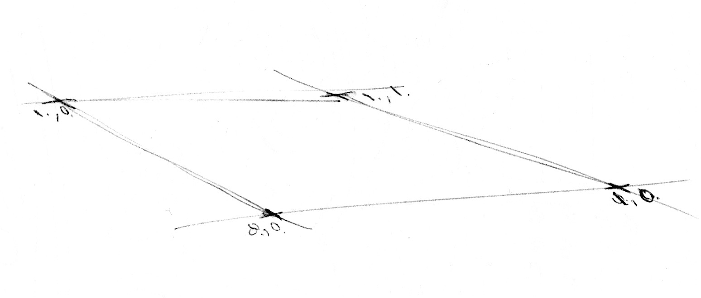
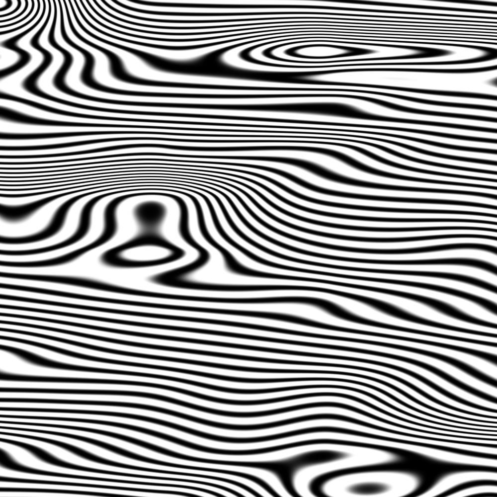
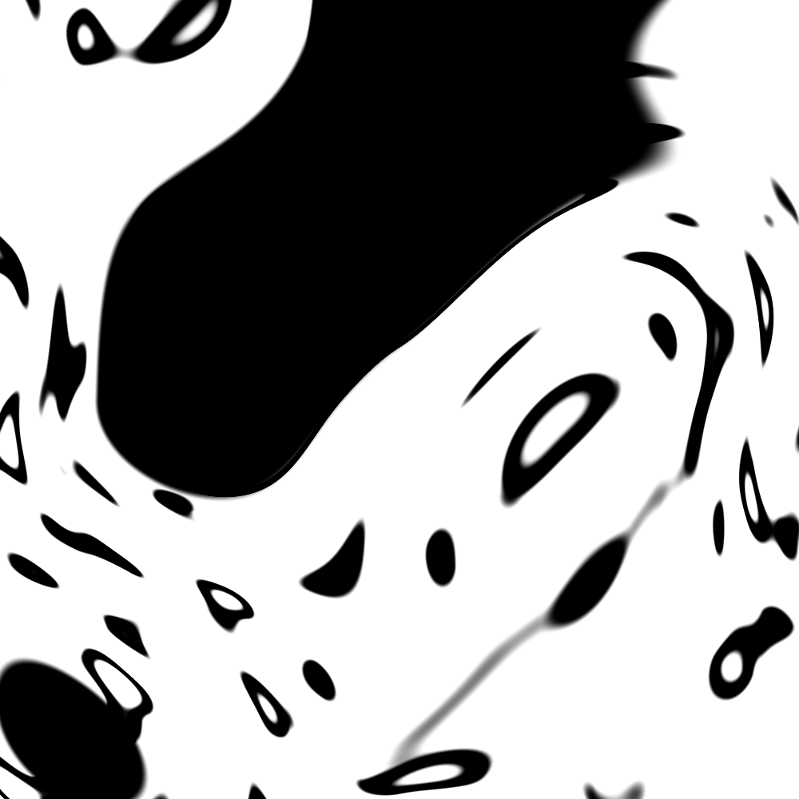
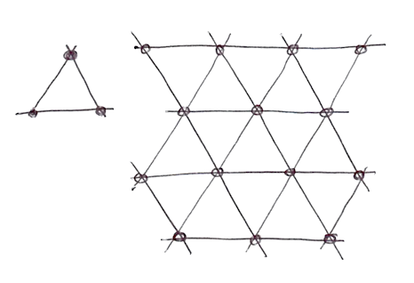

## Noise
## ノイズ


It's time for a break! We've been playing with random functions that look like TV white noise, our head is still spinning thinking about shaders, and our eyes are tired. Time to go out for a walk!

少し休憩しましょう。テレビのホワイトノイズみたいなランダム関数で遊んできて、頭はまだシェーダーのことでいっぱい。目も疲れてきました。散歩に出る時間です。

We feel the air on our skin, the sun in our face. The world is such a vivid and rich place. Colors, textures, sounds. While we walk we can't avoid noticing the surface of the roads, rocks, trees and clouds.

空気を肌に、日差しを顔に感じます。世界はこのように鮮やかで豊かな場所なのです。色、肌合い、音。歩いている間中、道や岩、木や雲の表情に気を取られずにはいられません。


The unpredictability of these textures could be called "random," but they don't look like the random we were playing with before. The “real world” is such a rich and complex place! How can we approximate this variety computationally?

これらのテクスチャーの不規則さをランダムと呼ぶこともできるでしょう。しかし、これらの外見は前の章で私たちが扱ってきたランダムとは違います。現実世界は実に豊かで複雑な場所なのです。どうすればコンピューターを用いてこの多様な世界に近づくことができるでしょうか。

This was the question [Ken Perlin](https://mrl.nyu.edu/~perlin/) was trying to solve in the eary 1980s when he was commissioned to generate more realistic textures for the movie "Tron." In response to that, he came up with an elegant *Oscar winning* noise algorithm. (No biggie.)

この疑問は1980年代初頭、「TRON」という映画のためによりリアルなテクスチャーを生成するという依頼を受けて[Ken Perlin](https://mrl.nyu.edu/~perlin/) が取り組んでいた問題です。 結果として、彼はオスカー賞に輝くエレガントなノイズ・アルゴリズムにたどりつきました。


The following is not the classic Perlin noise algorithm, but it is a good starting point to understand how to generate noise.

下記はクラシックなパーリンノイズのアルゴリズムではありませんが、ノイズを生成する方法について理解するためのよい出発点になります。

（訳注：「クラシックなパーリンノイズ」とはKen Perlinが最初に考案したアルゴリズムを、またここでの「ノイズ」はパーリンノイズに代表される、擬似乱数的でありながらスムーズな連続性を持ったアルゴリズムを指しています。）

<div class="simpleFunction" data="
float i = floor(x);  // integer
float f = fract(x);  // fraction
y = rand(i);
//y = mix(rand(i), rand(i + 1.0), f);
//y = mix(rand(i), rand(i + 1.0), smoothstep(0.,1.,f));
"></div>

In these lines we are doing something similar to what we did in the previous chapter. We are subdividing a continuous floating number (```x```) into its integer (```i```) and fractional (```f```) components. We use [```floor()```](.../glossary/?search=floor) to obtain ```i``` and [```fract()```](.../glossary/?search=fract) to obtain ```f```. Then we apply ```rand()``` to the integer part of ```x```, which gives a unique random value for each integer.

ここでは前の章と似たことをしています。連続的な浮動小数点数の値（```x```）を整数（```i```）と少数部分（```f```）に分けます。[```floor()```](.../glossary/?search=floor) を ```i``` を得るために、[```fract()```](.../glossary/?search=fract) を ```f``` を得るために使います。そして ```x``` の整数部分ごとに ```rand()``` を使ってランダムな値を生成します。

After that you see two commented lines. The first one interpolates each random value linearly.

その後にコメントのついた行が2行あります。1行目ではそれぞれのランダムな値を線形補間しています。

```glsl
y = mix(rand(i), rand(i + 1.0), f);
```

Go ahead and uncomment this line to see how this looks. We use the [```fract()```](.../glossary/?search=fract) value store in `f` to [```mix()```](.../glossary/?search=mix) the two random values.

この行のコメントを外して、どのように見えるか観察してみましょう。2つのランダムな値を [```mix()```](.../glossary/?search=mix) するために、```f``` に格納されている [```fract()```](.../glossary/?search=fract) の値を使います。

At this point in the book, we've learned that we can do better than a linear interpolation, right?
Now try uncommenting the following line, which uses a [```smoothstep()```](.../glossary/?search=smoothstep) interpolation instead of a linear one.

ところで、この本では線形補間よりもよい方法も学びましたね。次の行のコメントを外してみましょう。直線で補間する代わりに [```smoothstep()```](.../glossary/?search=smoothstep) が使われています。

```glsl
y = mix(rand(i), rand(i + 1.0), smoothstep(0.,1.,f));
```

After uncommenting it, notice how the transition between the peaks gets smooth. In some noise implementations you will find that programmers prefer to code their own cubic curves (like the following formula) instead of using the [```smoothstep()```](.../glossary/?search=smoothstep).

コメントを外したら、ピークとピークの間の変化がスムーズになっていることに注目してください。実際に世の中で使われているノイズの実装をいくつか見てみると、[```smoothstep()```](.../glossary/?search=smoothstep) よりも、カスタムの3次関数のカーブ（例えば下記のような式）をプログラマーは好んで用いることに気がつくでしょう。

```glsl
float u = f * f * (3.0 - 2.0 * f ); // custom cubic curve
y = mix(rand(i), rand(i + 1.0), u); // using it in the interpolation
```

This *smooth randomness* is a game changer for graphical engineers or artists - it provides the ability to generate images and geometries with an organic feeling. Perlin's Noise Algorithm has been implemented over and over in different languages and dimensions to make mesmerizing pieces for all sorts of creative uses.

ノイズの滑らかかつランダムな性質は、グラフィックエンジニアやアーティストにとって革新的なもので、有機的な表情を持つ画像や形状を生成する力を与えてくれます。パーリンノイズのアルゴリズムは様々な言語や場面で繰り返し実装され、あらゆるクリエィティブな領域で目を見張るような作品を作り出してきました。


Now it's your turn:

次はあなたの番です。

* Make your own ```float noise(float x)``` function.
* あなた自身の ```float noise(float x)``` 関数を作ってみましょう。

* Use your noise function to animate a shape by moving it, rotating it or scaling it.
* ノイズ関数を使って、1つの形が動いたり、回転したり、または大きさが変わったりするアニメーションを作りましょう。

* Make an animated composition of several shapes 'dancing' together using noise.
* ノイズを用いていくつかの形が一緒にダンスしているようなアニメーションを作りましょう。

* Construct "organic-looking" shapes using the noise function.
* ノイズ関数を使って有機的に見える形を描いてみましょう。

* Once you have your "creature," try to develop it further into a character by assigning it a particular movement.

* あなたの自身の創造物を生みだしたら、特有の動きを与えて個性を持ったキャラクターに発展させてみましょう。

## 2D Noise
## 2Dノイズ



Now that we know how to do noise in 1D, it's time to move on to 2D. In 2D, instead of interpolating between two points of a line (```fract(x)``` and ```fract(x)+1.0```), we are going to interpolate between the four corners of the square area of a plane (```fract(st)```, ```fract(st)+vec2(1.,0.)```, ```fract(st)+vec2(0.,1.)``` and ```fract(st)+vec2(1.,1.)```).

一次元のノイズを扱い方を学んだので、次は二次元に移りましょう。線上の2点（```fract(x)``` と ```fract(x)+1.0```）の間を補間する代わりに、平面上の正方形4つの角 （```fract(st)```, ```fract(st)+vec2(1.0,0.0)```, ```fract(st)+vec2(0.0,1.0)```, ```fract(st)+vec2(1.0,1.0)```）の間を補間します。


Similarly, if we want to obtain 3D noise we need to interpolate between the eight corners of a cube. This technique is all about interpolating random values, which is why it's called **value noise**.

同様にして、三次元のノイズを手に入れるには、立方体の8つの角の間を補間する必要があります。このテクニックはランダムな値の補間が全てなので、バリューノイズ とよばれています（訳注：value noiseの適当な日本語訳が見つかりませんでした。ご存知の方は教えてください）。


Like the 1D example, this interpolation is not linear but cubic, which smoothly interpolates any points inside our square grid.

一次元の例と同じく、この補間は線形ではなく3次関数によるもので、四角いグリッドの中のどの点もスムーズに補間できます。


Take a look at the following noise function.

下記のノイズ関数を見てください。

<div class="codeAndCanvas" data="2d-noise.frag"></div>

We start by scaling the space by 5 (line 45) in order to see the interpolation between the squares of the grid. Then inside the noise function we subdivide the space into cells. We store the integer position of the cell along with the fractional positions inside the cell. We use the integer position to calculate the four corners' coordinates and obtain a random value for each one (lines 23-26). Finally, in line 35 we interpolate between the 4 random values of the corners using the fractional positions we stored before.

まず空間を5倍に拡大します（45行目）。そしてノイズ関数の中で空間を升目に分割します。升目の位置を示す整数と、升目の中での位置を表す端数部分を共に変数に格納します。整数の位置を4つの角の座標の計算に用い、それぞれに対するランダムな値を獲得します（23-26行）。最後に35行目では、格納しておいた端数の位置を使って、角の4つのランダムな値の間を補間しています。

Now it's your turn. Try the following exercises:

あなたの番です。下記の課題に挑戦しましょう。

* Change the multiplier of line 45. Try to animate it.

* 45行目の掛ける数を変えてみましょう。また、このサンプルをアニメーションにしてみましょう。

* At what level of zoom does the noise start looking like random again?

* どのぐらいズームすると、ノイズがまたただのランダムに見え始めるでしょう。

* At what zoom level is the noise is imperceptible?

* ノイズが小さすぎて見えなくなるまでにはどれくらいズームすればよいでしょう。

* Try to hook up this noise function to the mouse coordinates.

* このノイズ関数をマウスの位置に対応して変化させてみましょう。

* What if we treat the gradient of the noise as a distance field? Make something interesting with it.

* ノイズのグラデーションをディスタンスフィールドとして扱うとどうなるでしょう。これを使って何か興味深いものを使ってください。

* Now that you've achieved some control over order and chaos, it's time to use that knowledge. Make a composition of rectangles, colors and noise that resembles some of the complexity of a [Mark Rothko](http://en.wikipedia.org/wiki/Mark_Rothko) painting.

* ある程度、秩序とカオスをコントロールできるようになったので、この知識を活用してみましょう。 いくつかの四角形と色、ノイズを組み合わせて[ロスコ](http://en.wikipedia.org/wiki/Mark_Rothko)の絵画のような複雑な表情の作品を作ってみましょう。


## Using Noise in Generative Designs
## ノイズを使ったジェネラティブデザイン

Noise algorithms were originally designed to give a natural *je ne sais quoi* to digital textures. The 1D and 2D implementations we've seen so far were interpolations between random *values*, which is why they're called **Value Noise**, but there are more ways to obtain noise...

ノイズのアルゴリズムは本来、自然な *je ne sais quoi* （訳注：言葉では表せない質感、美しさ）をデジタルなテクスチャーに与えるために考え出されました。ここまで見てきた一次元と二次元の実装はランダムな値の間の補間を行うもので、そのためバリューノイズと呼ばれていました。しかしノイズを作り出す方法はこれだけではありません。

[  ](../edit.html#11/2d-vnoise.frag)

As you discovered in the previous exercises, value noise tends to look "blocky." To diminish this blocky effect, in 1985 [Ken Perlin](https://mrl.nyu.edu/~perlin/) developed another implementation of the algorithm called **Gradient Noise**. Ken figured out how to interpolate random *gradients* instead of values. These gradients were the result of a 2D random function that returns directions (represented by a ```vec2```) instead of single values (```float```). Click on the following image to see the code and how it works.

課題の中で気付いたと思いますが、バリューノイズはブロック状に見えてしまいがちです。これを抑えるため、[Ken Perlin](https://mrl.nyu.edu/~perlin/) は1985年にグラデーションノイズ（gradient noise）と呼ばれるアルゴリズムを開発しました。このグラデーションは一次元の値（```float```）の代わりに、向きを持った（```vec2```）を返す二次元のランダム関数によって作り出されます。下記の画像をクリックしてコードを表示し、仕組みを見てみましょう。

[  ](../edit.html#11/2d-gnoise.frag)

Take a minute to look at these two examples by [Inigo Quilez](http://www.iquilezles.org/) and pay attention to the differences between [value noise](https://www.shadertoy.com/view/lsf3WH) and [gradient noise](https://www.shadertoy.com/view/XdXGW8).

上記2つの[Inigo Quilez](http://www.iquilezles.org/)によるサンプルをじっくり見比べてみましょう。[バリューノイズ](https://www.shadertoy.com/view/lsf3WH)と[グラデーションノイズ](https://www.shadertoy.com/view/XdXGW8)との違いに注目してください。

Like a painter who understands how the pigments of their paints work, the more we know about noise implementations the better we will be able to use them. For example, if we use a two dimensional noise implementation to rotate the space where straight lines are rendered, we can produce the following swirly effect that looks like wood. Again you can click on the image to see what the code looks like.

絵の具の中の顔料の働きを理解している画家のように、ノイズの実装方法について詳しくなるほど、より上手に使いこなせるようになります。例えば複数の直線が描かれた空間を回転させるために二次元のノイズを使うと下記の通り、木目のように見える渦巻き状の効果を作り出すことができます。画像をクリックするとコードも見ることができます。

[  ](../edit.html#11/wood.frag)

```glsl
    pos = rotate2d( noise(pos) ) * pos; // rotate the space
    pattern = lines(pos,.5); // draw lines
```

Another way to get interesting patterns from noise is to treat it like a distance field and apply some of the tricks described in the [Shapes chapter](../07/).

ノイズから面白いパターンを作り出すもう1つの方法は、ノイズをディスタンスフィールドのように扱い、[形について](../07/)の章で取り上げたテクニックを応用することです。

[  ](../edit.html#11/splatter.frag)

```glsl
    color += smoothstep(.15,.2,noise(st*10.)); // Black splatter
    color -= smoothstep(.35,.4,noise(st*10.)); // Holes on splatter
```

A third way of using the noise function is to modulate a shape. This also requires some of the techniques we learned in the [chapter about shapes](../07/).

3つ目の方法はノイズ関数を図形を変形させるのに使うことです。これにもまた[形について](../07/)の章で学んだテクニックが必要になります。

<a href="../edit.html#11/circleWave-noise.frag"><canvas id="custom" class="canvas" data-fragment-url="circleWave-noise.frag"  width="300px" height="300"></canvas></a>

For you to practice:

練習してみましょう。

* What other generative pattern can you make? What about granite? marble? magma? water? Find three pictures of textures you are interested in and implement them algorithmically using noise.

* 他にどんなパターンが生成できるでしょう。御影石、大理石、マグマ、水のようなパターンはどうでしょう。好きなパターンの画像を3つ用意して、ノイズを使ったアルゴリズムで実装してください。

* Use noise to modulate a shape.

* ノイズを使って図形を変形させてください。

* What about using noise for motion? Go back to the [Matrix chapter](../08/). Use the translation example that moves the "+" around, and apply some *random* and *noise* movements to it.

* ノイズを動きのために使うのはどうでしょう。[二次元行列](../08/)の章を振り返ってください。小さな十字を平行移動させるサンプルを使ってランダムとノイズを応用した動きをさせてみましょう。

* Make a generative Jackson Pollock.
* アルゴリズム版のポロックを作り出しましょう。


## Simplex Noise
## シンプレックスノイズ

For Ken Perlin the success of his algorithm wasn't enough. He thought it could perform better. At Siggraph 2001 he presented the "simplex noise" in which he achieved the following improvements over the previous algorithm:

Ken Perlinにとって彼のアルゴリズムの成功は十分ではありませんでした。彼はもっとパフォーマンスをあげられると考えたのです。2001年のSiggraphで彼は、以前のアルゴリズムに比べて下記の改良を実現したシンプレックスノイズを発表しました。

* An algorithm with lower computational complexity and fewer multiplications.

* よりシンプルで乗算の回数が少ない。

* A noise that scales to higher dimensions with less computational cost.

* 次元の数が増えても計算量の増加が抑えられる。

* A noise without directional artifacts.

* 向きによって生じるアーティファクトがない。

* A noise with well-defined and continuous gradients that can be computed quite cheaply.

* 非常に計算量の少ない、矛盾なく定義（[well-defined](https://ja.wikipedia.org/wiki/Well-defined)）された[連続](https://ja.wikipedia.org/wiki/%E9%80%A3%E7%B6%9A_(%E6%95%B0%E5%AD%A6))なグラデーション
（訳注：どこを取っても拡大すれば滑らかに繋がっているグラデーションが軽い処理で実現できる、程度に思ってください。もう少し厳密な説明はリンク先をどうぞ）。

* An algorithm that is easy to implement in hardware.

* ハードウェアで実現しやすいアルゴリズム。

I know what you are thinking... "Who is this man?" Yes, his work is fantastic! But seriously, how did he improve the algorithm? Well, we saw how for two dimensions he was interpolating 4 points (corners of a square); so we can correctly guess that for [three (see an implementation here)](../edit.html#11/3d-noise.frag) and four dimensions we need to interpolate 8 and 16 points. Right? In other words for N dimensions you need to smoothly interpolate 2 to the N points (2^N). But Ken smartly noticed that although the obvious choice for a space-filling shape is a square, the simplest shape in 2D is the equilateral triangle. So he started by replacing the squared grid (we just learned how to use) for a simplex grid of equilateral triangles.

この男は一体何者だ、と思っているかもしれませんね。そう、彼の仕事は本当に素晴らしい。しかし実際、どうやって彼はアルゴリズムを改善したのでしょう。

私たちは二次元のノイズで4つの頂点（正方形の角）の間を補間するのを見ました。ここから三次元では8頂点（[実装例](../edit.html#11/3d-noise.frag)）、四次元では16頂点の補間が必要なことも推測できます。分かりますね。言い換えればN次元に対しては2のN乗の頂点を補間する必要があります。しかしKen Perlinはここで賢くも気付きました。空間を隙間なく埋める形として正方形を選ぶのは当然だけれども、二次元空間で最もシンプルな形は正三角形です。そこで彼は（我々がこの章でやり方を学んだ）正方形のグリッドを単純な正三角形で置き換えることから始めたのです。



The simplex shape for N dimensions is a shape with N + 1 corners. In other words one fewer corner to compute in 2D, 4 fewer corners in 3D and 11 fewer corners in 4D! That's a huge improvement!

N次元に対して最も単純な形は N + 1 の頂点を持ちます。つまり二次元に対しては1頂点、三次元に対しては4頂点、四次元に対しては11頂点少ない計算で済むのです。これは大幅な改善です。

In two dimensions the interpolation happens similarly to regular noise, by interpolating the values of the corners of a section. But in this case, by using a simplex grid, we only need to interpolate the sum of 3 corners.

シンプレックスノイズでも、二次元では普通のノイズの場合と同様に領域の頂点の値の補間が行われますが、より簡単な（正三角形の）グリッドを用いるので3つの頂点に対してだけ補間をすれば良いのです。


How is the simplex grid made? In another brilliant and elegant move, the simplex grid can be obtained by subdividing the cells of a regular 4 cornered grid into two isosceles triangles and then skewing it until each triangle is equilateral.

どうやってこのグリッドは作られるのでしょう。ここがもう1つの素晴くエレガントなアイデアなのですが、正三角形のグリッドは正方形のグリッドを2つの二等辺三角形に分割し、それを正三角形になるまで斜めに変形させていくことで得ることができます。


Then, as [Stefan Gustavson describes in this paper](http://staffwww.itn.liu.se/~stegu/simplexnoise/simplexnoise.pdf): _"...by looking at the integer parts of the transformed coordinates (x,y) for the point we want to evaluate, we can quickly determine which cell of two simplices that contains the point. By also comparing the magnitudes of x and y, we can determine whether the point is in the upper or the lower simplex, and traverse the correct three corner points."_

そしてStefan Gustavsonが[論文で説明しているように](http://staffwww.itn.liu.se/~stegu/simplexnoise/simplexnoise.pdf)、「変形された座標（x, y）の整数部分を見ることで、評価したい点がどの2つの三角形からなるマス目に含まれるのかを簡単に決定することができます。またxとyの値を比べることで上下どちらの三角形に含まれているのかも分かり、正しい3つの頂点に対して処理をすることができます」。


In the following code you can uncomment line 44 to see how the grid is skewed, and then uncomment line 47 to see how a simplex grid can be constructed. Note how on line 22 we are subdividing the skewed square into two equilateral triangles just by detecting if ```x > y``` ("lower" triangle) or ```y > x``` ("upper" triangle).

下記のコードでは、44行目のコメントを外すとどのようにグリッドが歪められるか、47行目のコメントを外すとどのように正三角形のグリッドが構成されるかを見ることができます。
22行目では、```x``` と ```y``` を比較するだけで歪められた正方形を2つの正三角形に分割していることに注目してください（```x > y``` であれば下の三角形、```y >= x``` であれば上の三角形です）。

<div class="codeAndCanvas" data="simplex-grid.frag"></div>

Another improvement introduced by Perlin with **Simplex Noise**, is the replacement of the Cubic Hermite Curve ( _f(x) = 3x^2-2x^3_ , which is identical to the [```smoothstep()```](.../glossary/?search=smoothstep) function) for a Quintic Hermite Curve ( _f(x) = 6x^5-15x^4+10x^3_ ). This makes both ends of the curve more "flat" so each border gracefully stiches with the next one. In other words you get a more continuous transition between the cells. You can see this by uncommenting the second formula in the following graph example (or see the [two equations side by side here](https://www.desmos.com/calculator/2xvlk5xp8b)).

Ken Perlinがシンプレックスノイズで導入したもう1つの改善点は、3次エルミート曲線（f(x) = 3x^2-2x^3 これは [```smoothstep()```](.../glossary/?search=smoothstep)関数と同等です）を4次エルミート曲線（f(x) = 6x^5-15x^4+10x^3）で置き換えたことです。これによって曲線の両端がより平坦になり、隣の曲線に綺麗につながることで、マス目間の変化がより滑らかになります。下記のグラフの2つ目の式のコメントを外すと実際に見ることができます（もしくは[ここ](https://www.desmos.com/calculator/2xvlk5xp8b)で並べて比較することもできます）。


<div class="simpleFunction" data="
// Cubic Hermine Curve.  Same as SmoothStep()
y = x*x*(3.0-2.0*x);
// Quintic Hermine Curve
//y = x*x*x*(x*(x*6.-15.)+10.);
"></div>

Note how the ends of the curve change. You can read more about this in [Ken's own words](http://mrl.nyu.edu/~perlin/paper445.pdf).

カーブの端の様子がどのように変わるかに注目しましょう。より詳しく知りたければ[Ken Perlin自身の言葉](http://mrl.nyu.edu/~perlin/paper445.pdf)で読むこともできます。

All these improvements result in an algorithmic masterpiece known as **Simplex Noise**. The following is a GLSL implementation of this algorithm made by Ian McEwan (and presented in [this paper](http://webstaff.itn.liu.se/~stegu/jgt2012/article.pdf)) which is overcomplicated for educational purposes, but you will be happy to click on it and see that it is less cryptic than you might expect.

これら全ての改善の結果、シンプレックスノイズというアルゴリズムの傑作が生まれました。下記はIan McEwanが[この論文](http://webstaff.itn.liu.se/~stegu/jgt2012/article.pdf)で示したGLSLによるアルゴリズムの実装です。教育目的のためかなり複雑になっていますが、実際のコードはそれほど謎めいていないので安心してください。下記の画像をクリックして見てみましょう。

[  ](../edit.html#11/2d-snoise-clear.frag)

Well... enough technicalities, it's time for you to use this resource in your own expressive way:

技術的な話は十分ですね。今度はこの財産をあなたの表現に使う番です。

* Contemplate how each noise implementation looks. Imagine them as a raw material, like a marble rock for a sculptor. What can you say about about the "feeling" that each one has? Squinch your eyes to trigger your imagination, like when you want to find shapes in a cloud. What do you see? What are you reminded of? What do you imagine each noise implementation could be made into? Following your guts and try to make it happen in code.

* それぞれのノイズの実装をじっくり見てみましょう。これらを彫刻家にとっての大理石の岩のような加工前の材料だと想像してください。それぞれの素材が持つ感覚や風合いについて何が言えますか。想像力を働かせるために目を細めてみましょう、雲の中に形を見つけるときのように。何が見えますか。何を思い出しますか。それぞれのノイズはどんなものに作り変えることができるでしょう。直感に従ってコードで実現してみましょう。

* Make a shader that projects the illusion of flow. Like a lava lamp, ink drops, water, etc.

* [ラバランプ](https://www.google.com/search?q=lava+lamp&espv=2&biw=1682&bih=1148&source=lnms&tbm=isch&sa=X&ved=0ahUKEwiHraP9gLDKAhUY7mMKHbqhBVIQ_AUIBygC)、インクの水滴、水などのように、流れているかのような錯覚を起こさせるシェーダーを作ってください。


<a href="../edit.html#11/lava-lamp.frag"><canvas id="custom" class="canvas" data-fragment-url="lava-lamp.frag"  width="520px" height="200px"></canvas></a>

* Use Simplex Noise to add some texture to a work you've already made.

* シンプレックスノイズを使ってこれまで作った作品にテクスチャーを加えてみましょう。

<a href="../edit.html#11/iching-03.frag"><canvas id="custom" class="canvas" data-fragment-url="iching-03.frag"  width="520px" height="520px"></canvas></a>

In this chapter we have introduced some control over the chaos. It was not an easy job! Becoming a noise-bender-master takes time and effort.

この章ではカオスを多少なりとも制御してみました。簡単というわけにはいきませんでしたね。ノイズ使いの達人になるには時間も努力も必要です。

In the following chapters we will see some well known techniques to perfect your skills and get more out of your noise to design quality generative content with shaders. Until then enjoy some time outside contemplating nature and its intricate patterns. Your ability to observe needs equal (or probably more) dedication than your making skills. Go outside and enjoy the rest of the day!

続く章ではスキルを完璧なものにし、シェーダーによる質の高い作品作りにノイズをさらに生かすため、幾つかの有名なテクニックを見ていくことになります。それまでの間、少し外で自然とその複雑なパターンをじっくり眺めて楽しんでください。物事を観察するスキルは、何かを作り出すスキルと同じくらいの（もしかするともっと）献身を必要とします。外に出かけて残りの一日を楽しみましょう。

<p style="text-align:center;">「木に話しかけよう。友達になるんだ。」
	<a href="https://ja.wikipedia.org/wiki/%E3%83%9C%E3%83%96%E3%83%BB%E3%83%AD%E3%82%B9">ボブの絵画教室</a></p>