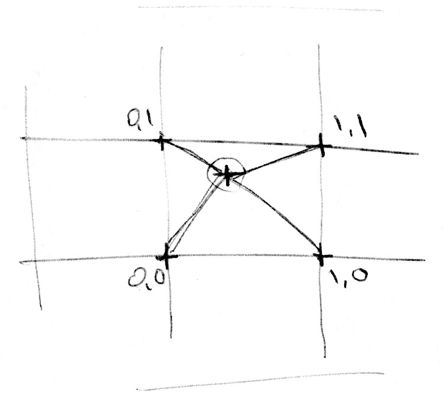
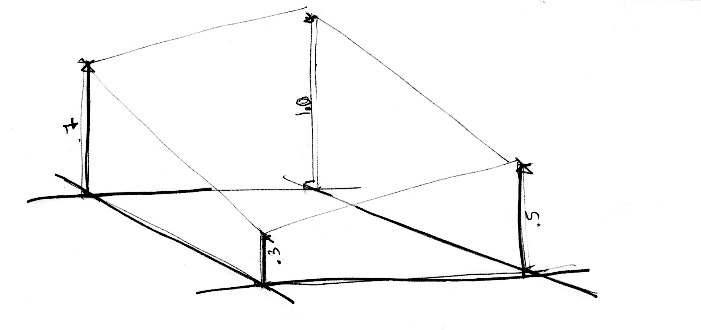

## Noise

Break time! We have been playing with all this random functions that looks like TV white noise, our head is still spinning around thinking on shaders, and our eyes are tired. Time to get out for a walk!

We feel the air in our face, the sun in our nose and chicks. The world is such a vivid and rich place. Colors, textures, sounds. While we walk we can't avoid noticing the surface of the roads, rocks, trees and clouds. We note the stochasticity of textures, there is random on nature. But definitely not the type of random we were making in the previus chapter. The “real world” is such a rich place. How we can approximate to this level of variety computationally?

We are on the same path of thoughts that [Ken Perlin](https://mrl.nyu.edu/~perlin/)'s walk through on 1982 when he was commissioned with the job of generating "more realistic" textures for a new disney movie call "Tron". In response to that he came up with an elegant *oscar winner* noise algorithm.

The following is not the clasic Perlin noise algorithm, but is a good starting point to understand how to generate *smooth random* aka *noise*.

In the following graph you will see what we were doing on the previus chapter, obtaining ```rand()``` numbers of the integers of the `x` position (assigning it to `i` variable), while we keep the [```fract()```](.../glossary/?search=fract) part of it (and storing it on the `f` variable).

<div class="simpleFunction" data="
float i = floor(x);  // integer
float f = fract(x);  // fraction
y = rand(i);
//y = mix(rand(i), rand(i + 1.0), f);
//y = mix(rand(i), rand(i + 1.0), smoothstep(0.,1.,f));
"></div>

You will see also, two commented lines. The first one interpolates linearly between the random value of the integer position and it next one.

```glsl
y = mix(rand(i), rand(i + 1.0), f);
``` 

Uncomment it an see how that looks. See how we use the [```fract()```](.../glossary/?search=fract) value store in `f` to [```mix()```](.../glossary/?search=mix) the two random values.

At this point on the book, we learned that we can do better than a linear interpolation. Right? 
The following commented line, will transfor the linear interpolation of `f` with a [```smoothstep()```](.../glossary/?search=smoothstep) interpolation.

```glsl
y = mix(rand(i), rand(i + 1.0), smoothstep(0.,1.,f));
```

Uncomment that line and notice how the transition between the peaks got smooth. On some noise implementations you will find that people that some programers prefere to code their own cubic curves (like the following formula) instead of using the [```smoothstep()```](.../glossary/?search=smoothstep).

```glsl
float u = f * f * (3.0 - 2.0 * f ); // custom cubic curve
y = mix(rand(i), rand(i + 1.0), u); // using it in the interpolation
```

The *smooth random* is a game changer for graphical coders, it provides the hability to generate images and geometries with an organic feeling. Perlin's Noise Algorithm have been reimplemented over and over in different lenguage and dimensions for all kind of uses to create all sort of mesmerizing pieces.


Now is your turn:

* Make your own ```float noise(float x)``` function.
* Use the noise funtion to animate a shape by moving it, rotating it or scaling it.
* Make an animated composition of several shapes 'dancing' together using noise.
* Construct "organic-looking" shapes using the noise function.
* Once you have your "creature", try to develop further this into a character by assigning it a particular movement.

## 2D Noise


Now that we know how to do noise in one dimension, is time to port it to two. For that instead of interpolating between two points (```fract(x)``` and ```fract(x)+1.0```) we are going to interpolate between the four coorners of square (```fract(st)```, ```fract(st)+vec2(1.,0.)```, ```fract(st)+vec2(0.,1.)``` and ```fract(st)+vec2(1.,1.)```). 



Take a look to the following 2D noise function, see how on line 32 we interpolate random values (lines 25-28) acording to the the position of ```st``` the four corners of the squared area.



If you pay atention is not just a linear interpolation but a cubic one which smoothly interpolates any points inside a squared grid


In the following implementation of 2D noise we scale the size of the grid by 5 (line 41).

<div class="codeAndCanvas" data="2d-noise.frag"></div>

Now is your turn, try the following excersices:

* Change the multiplier. Try to animate it.

* At what level of zoom the noise start looking like random again?

* At what zoom level the noise is imperceptible.

* Change the u_time by the normalize values of the mouse coordinates.

* What if we treat the gradient of the noise as a distance field? Make something interesing with it.

* Now that you achieve some control over order and chaos, is time to use that knowledge. Make a composition of rectangles, colors and noise that resemble some of the complexity of the texture of the following painting made by [Mark Rothko](http://en.wikipedia.org/wiki/Mark_Rothko).


## Using Noise on generative designs

As we saw, noise algorithms was original designed to give a natural *je ne sais quoi* to digital textures. Our first step to use it will be to differenciate different types of noise algorithms. So far all the implementations in 1D and 2D we saw, were interpolation between values and so they are usually call **Value Noise**. 

<a href="../edit.html#11/2d-vnoise.frag"><canvas id="custom" class="canvas" data-fragment-url="2d-vnoise.frag"  width="520px" height="200px"></canvas> <p style="text-align: center;font-style: italic;">Value Noise by IQ</p></a>

As you discovery on the previus excercises this type of noise tends to look "block", as a solution to this effect in 1985 again [Ken Perlin](https://mrl.nyu.edu/~perlin/) develop another implementation of the algorithm call **Gradient Noise**. In it what is interpolated per coorner is not a value but a direction (represented by a ```vec2```).

<a href="../edit.html#11/2d-gnoise.frag"><canvas id="custom" class="canvas" data-fragment-url="2d-gnoise.frag"  width="520px" height="200px"></canvas> <p style="text-align: center;font-style: italic;">Gradient Noise by IQ</p></a>

Take a minute to look to these two examples by [Inigo Quilez](http://www.iquilezles.org/) and pay attention on the differences between [value noise](https://www.shadertoy.com/view/lsf3WH) and [gradient noise](https://www.shadertoy.com/view/XdXGW8).

As a painter that understand how the pigments of their paint works, the more we know about noise implementations the better we will learn how to use it. The following step is to find interesting way of combining and using it.

For example, if we use a two dimensional noise implementation to rotate the "grid" we can produce the following effect that looks a lot like wood  

<a href="../edit.html#11/wood.frag"><canvas id="custom" class="canvas" data-fragment-url="wood.frag"  width="520px" height="200px"></canvas></a> 

```glsl
    pos = rotate2d( noise(pos) ) * pos; // rotate the space
    pattern = lines(pos,.5); // draw lines
```

Another way to get interesting patterns from noise is to treat it like a distance field and apply some of the tricks described on the [Shapes chapter](../07/)

<a href="../edit.html#11/splatter.frag"><canvas id="custom" class="canvas" data-fragment-url="splatter.frag"  width="520px" height="200px"></canvas></a> 

```glsl
    color += smoothstep(.15,.2,noise(st*10.)); // Black splatter
    color -= smoothstep(.35,.4,noise(st*10.)); // Holes on splatter
```

The third way of using the noise function is using it to modulate a shapes, this probably require reviewing the [Shapes Chapter](../07/)

<a href="../edit.html#11/circleWave-noise.frag"><canvas id="custom" class="canvas" data-fragment-url="circleWave-noise.frag"  width="520px" height="520"></canvas></a> 

* What other generative pattern can you make? What about granite? marble? magma? water? Find three pictures of  textures you are interested and implement them algorithmically using noise.
* Use noise to modulate a shapes.
* What about using noise for motion? Go back to the [Matrix chapter](../08/) and use the translation example that move a the "+" around to apply some *random* and *noise* movements to it.
* Make a generative Jackson Pollock


## Simplex Noise

For Ken Perlin the success of his algorithm wasn't enough. He thought it could performance better. In Siggraph 2001 he presented the "simplex noise" in wich he achive the following improvements over the previus one:

* An algorithm with lower computational complexity and fewer multiplications.
* A noise that scales to higher dimensions with less computational cost.
* A noise without directional artifacts
* A noise with well-defined and continuous gradients that can be computed quite cheaply
* An algorithm that is easy to implemnt in hardware

Yeah, right? I know what you are thinking... "Who is this man?". Yes, his work is fantastic. But seriusly, How he did that? Well we saw how for two dimensions he was interpolating 4 points (coorners of a square); also we can correctly preasume that for [three (see an implementation here)](../edit.html#11/3d-noise.frag) and four dimensions we need to interpolate 8 and 16 points. Right? In other words for N dimensions you need to smoothly interpolate 2 to the N points (2^N). But Ken smartly notice that although the obvious choice for a space-filling shape is a squar, but actually the formal simplex shape in 2D is an equilateral triangle. That means that the simplex shape for N dimensions is a shape with N + 1 corners. In other words one less corner to compute in 2D, 4 less coorners in 3D and 11 less coorners in 4D! That's a huge improvement!

It worths taking a look to [this paper where Stefan Gustavson](http://staffwww.itn.liu.se/~stegu/simplexnoise/simplexnoise.pdf) explains all the beauty and elegance of Ken Perlin's Simplex Noise. Couting from it:

"A point P inside a simplex gets contributions to its value only from the three kernels centered on the surrounding corners (shaded, red circles). Kernels at corners farther away (green circles) decay to zero before they cross the boundary to the simplex containing P. Thus, the noise value at each point can always be calculated as a sum of three terms."

Here is an actual GLSL implementation of this algorithm

<div class="codeAndCanvas" data="2d-snoise.frag"></div>

Now:

* Take a closer look to the implementation and their results. Beside the eficient improvements, what you can say about how it looks?

* Make a shader that project the ilusion of flow. Like a lava lamp, ink drops, watter, etc.

<a href="../edit.html#11/lava-lamp.frag"><canvas id="custom" class="canvas" data-fragment-url="lava-lamp.frag"  width="520px" height="200px"></canvas></a> 

Nothing like having some control over the chaos and chances. Right?
Noise is one of those subjects that you can dig and always find new exciting formulas. In fact if you think of it, noise means different things for different people. Musicians will think in audio noise, communicators into interference, and astrophysics on cosmic microwave background. On the next chapter we will use some related concepts from sign and audio behavior to our noise function to explore more uses of noise.
