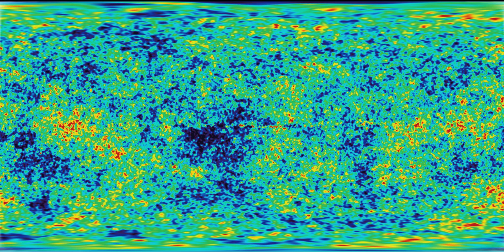

## Noise

Break time! We have been playing with all this random functions that looks like TV white noise,  our head is still spinning around thinking on shaders, and our eyes are tired. Time to get out side for a walk!

We feel the air in our face, the sun in our nose and chicks. The world is such a vivid and rich places. Colors, textures, sounds. While we walk we can avoid notice the surface of the roads, rocks, trees and clouds. We note the stochasticity of textures, there is random on nature. But definitely not the type of random we were making. The “real world” is such a rich place. How we can approximate to this level of variety computationally?

We are on the same path of thoughts that Ken Perlin's walk through on 1982 when he was commissioned with the job of generating "more realistic" textures for a new disney movie call "Tron". In response to that he came up with an elegant *oscar winner* noise algorithm.

The following is not the Perlin noise algorithm, but is a good starting point to start getting out head around the idea of how to generate *noise* o *smooth random*.

Look the following graph, is in essence what we where doing on line 36 and 37 on the last example of the previus chapter. We are computing the ```rand()``` of the integers of `x` (the `i` variable). 

<div class="simpleFunction" data="
float i = floor(x);  // integer
float f = fract(x);  // fraction
y = rand(i);
//y = mix(rand(i), rand(i + 1.0), f);
//y = mix(rand(i), rand(i + 1.0), smoothstep(0.,1.,f));
"></div>

By uncommenting the following line, you can make a linear interpolation between the random value of an integer to the next one.

```glsl
y = mix(rand(i), rand(i + 1.0), f);
``` 

At this point we have learn that we can do better than a linear interpolation. Right? By uncommenting the following line, we will use the native ```smoothstep()``` to make a *smooth* transition between the previous random values. 

```glsl
y = mix(rand(i), rand(i + 1.0), smoothstep(0.,1.,f));
```

You will find in other implementations that people use cubic curves ( like the following formula) instead of using a ```smoothstep()```.

```glsl
float u = f * f * (3.0 - 2.0 * f );
y = mix(rand(i), rand(i + 1.0), u);
```

## 2D Noise

Now that we understand how noise is made in one dimension, is time to port it to two. Check how on the following code the interpolation (line 29) is made between the for corners of a square (lines 22-25).

<div class="codeAndCanvas" data="2d-noise.frag"></div>

At this point you can recognize what's going on at line 40. We are scaling and "moving" the space, right?

Try:

* Change the multiplier. Try to animate it.

* At what level of zoom the noise start looking like random again?

* At what zoom level the noise is imperceptible.

* Change the u_time by the normalize values of the mouse coordinates.

* Now that you achieve some control over noise & chaos, is time to mix it with previous knowledge. Making a composition of rectangles, colors and noise that resemble some of the complexity of the texture of the following painting made by [Mark Rothko](http://en.wikipedia.org/wiki/Mark_Rothko).


## Simplex Noise

## Digital Jackson Pollock

## Using 2D Noise to rotate the space

As we saw, noise was designed to give a natural *je ne sais quoi* to digital textures, and could be use to make convincing generative textures. Lets refresh some of the previous knowledge and then jump forward learning how to mix all the knowledge we have learn so far. 

In the following code you will find:

* Shaping functions to create: random (line 13), noise (line 32) and a line pattern (line 46).
* A color gradient (line 68).
* A matrix to rotate the line pattern (line 37-40 and 45)
* A 2d random function (line 12-16)
* A 2d noise function (line 20-35) 

<div class="codeAndCanvas" data="wood.frag"></div>

By uncommenting line 60 you will see the line pattern we are talking about.
Revealing line 63 you can see how we can alternate this pattern in a "natural-like" way, to then finally, uncommenting line 66 we can stretch the noise pattern in *y* axis.

Wow! You really should be proud of your self. He have went from nothing to generating our own wood procedural texture!

Now is time for you to play with it:

* What do you thing it will happen if the patter looks like this:

```glsl
pattern = sin(lines(pos, noise(pos*vec2(2.,0.5)),0.5)*3.14);
```

Or like this

```glsl
pattern = fract(lines(pos, noise(pos*vec2(2.,0.5)),0.5)*2.0);
```

* What other generative pattern can you make? What about granite? marble? magma? water?
* What about noise apply to motion? Go back to the Matrix chapter and use the translation example that move a the "+" around to apply some *random* and *noise* movements to it.

Nothing like having some control over the chaos and chances. Right?
Noise is one of those subjects that you can dig and always find new exciting formulas. In fact, noise means different things for different people. Musicians will think in audio noise, communicators into interference, and astrophysics on cosmic microwave background. On the next chapter we will use some related concepts from sign and audio behavior to our noise function to explore more uses of noise.

